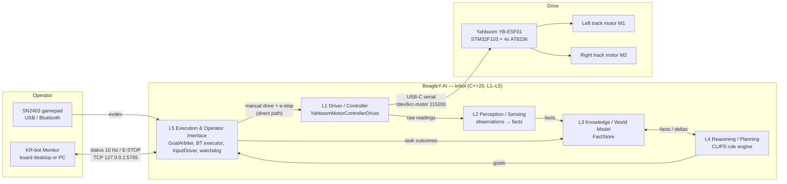
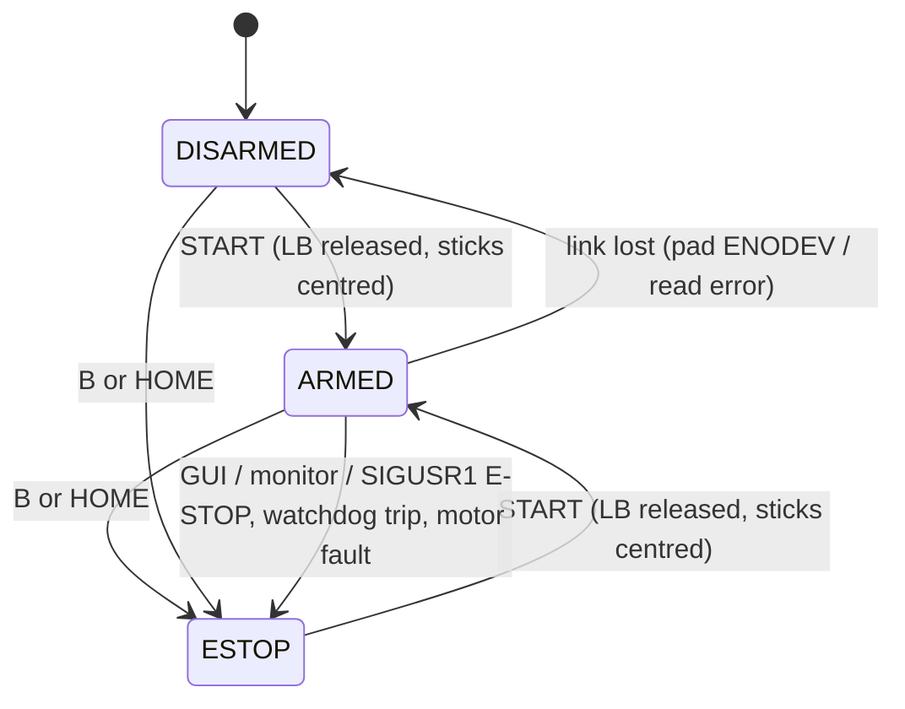
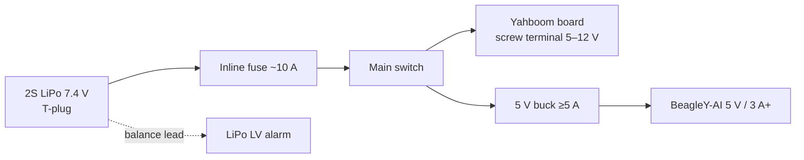
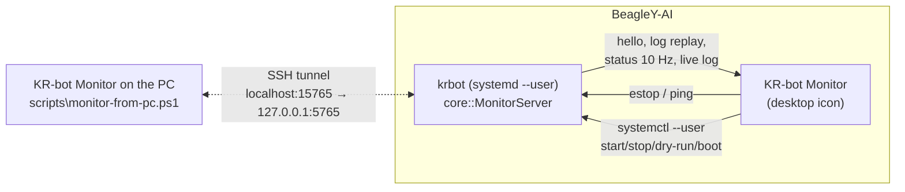
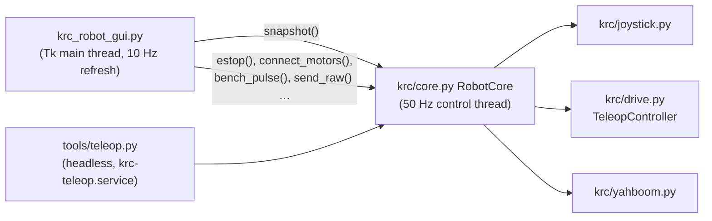

# KR-Robot

KR-Robot is a skid-steer tracked robot. A BeagleY-AI (TI AM67A, Debian 13) runs all the software, and a Yahboom STM32 co-processor drives the motors. This repo holds:

- the production **C++ 5-layer stack**, `krbot`
- its monitoring client
- the Python bench tools
- the architecture and the design decisions behind it

> **Status (2026-10-02):** Phase 0–1.
>
> - The **C++ 5-layer stack** ([krbot/](krbot/)) runs as a systemd user service. Its 50 Hz manual-drive path, watchdog and goal arbiter work, and all 43 unit tests pass on the target.
> - **KR-bot Monitor** ([§7.1](#71-kr-bot-monitor-monitoring-the-c-stack)) is its client/server monitoring window. It runs on the BeagleY-AI desktop, or on the PC through an SSH tunnel.
> - The Python bench tooling and the **KR-Robot Control** app are deployed.
> - The SN2403 is verified wired (xpad). Onboard BLE is enabled and survives a reboot.
> - **Next:** verify the motor board's serial protocol on the bench ([docs/bringup.md](docs/bringup.md)). Then Phase 1: CLIPS and BehaviorTree.CPP.

---

## 1. System overview

| Item | Part | Notes |
|---|---|---|
| Compute | BeagleY-AI (AM67A) | Runs L1–L5. 3.3 V GPIO only |
| Motor controller | Yahboom 4-ch Encoder Motor Drive Module, YB-ESF01-V2.0 | STM32F103RCT6, AT8236 ×4, CH340K USB-UART, 5–12 V in |
| Drive motors (now) | doit.am 33GB-520-18.7, 12 V, 350 RPM | ×2, **no encoder**, open-loop PWM |
| Drive motors (planned) | Yahboom MD520Z30_12V, 333 RPM 1:30, 11-line hall encoder | Matches Yahboom motor type 1 profile |
| Chassis | Aluminium tracked chassis | Skid-steer, one motor per track |
| Battery | 2S LiPo 7.4 V 5400 mAh 50C | Fuse, switch and LV alarm required (§5) |
| Operator input | SN2403 game controller | Wired XInput, Bluetooth, or 2.4 GHz receiver (not supplied) |

---

## 2. Software architecture: five layers

The authoritative design is **Design doc v3**, "KR-bot Agentic Software Architecture" (`Engineering/Projects/KRC-Robot/Design/knowledge-agent-architecture.md`, kept outside this repo). [docs/system-design.md](docs/system-design.md) is the first-cut system design that maps it onto the code in [krbot/](krbot/), with deviations recorded. Sensor data flows up from L1 to L3, goals flow down from L4 to L5, and commands flow down from L5 to L1.

| Layer | Responsibility (doc v3) | Code (`krbot/src/…`) | State (first increment) |
|---|---|---|---|
| **L1 Driver / Controller** | Talk to hardware through typed interfaces, with no semantics | `driver/`: `IMotorController`, `YahboomMotorControllerDriver`, `SerialPort`, `I2CDevice`, `DriverRegistry` | **Real.** USB serial driver, plus a sim for dry runs |
| **L2 Perception / Sensing** | Turn raw readings into observations, filter them, and map them to facts | `percep/`: `PerceptionLoop`, `ObservationMapper`, `MotorHealthSource` | Skeleton. Motor-link health only |
| **L3 Knowledge / World Model** | `FactStore`, the single source of truth, owned by its own thread | `knowledge/`: `FactTable`, `FactStore` | Working in memory. SQLite persistence is Phase 4 |
| **L4 Reasoning / Planning** | CLIPS rule engine that posts goals | `reason/`: `IReasoner`, `ReasoningLoop`, `NullReasoner` | Stub. `ClipsEngine` arrives in Phase 1 |
| **L5 Execution & Operator Interface** | BT.CPP execution, GoalArbiter, gamepad, watchdog | `exec/`: `ManualDrive`, `TeleopSafety`, `InputDriver`, `Watchdog`, `GoalArbiter` | **Real** for teleop, the watchdog and the arbiter. BT executor is a stub |
| core (wiring) | Lifecycle, config, observability | `core/`: `App`, `MonitorServer`, `main` | **Real.** Safety-first shutdown order and the monitor server |

### 2.1 Direct path for manual drive and e-stop

Manual drive and e-stop go **straight from L5 to L1** (`ManualDrive`), bypassing L3/L4 and the goal arbiter. A fault or stall in the autonomy stack therefore cannot block a stop command.

An independent `Watchdog` thread backs this up. If the control loop stops ticking for 200 ms, the watchdog calls `IMotorController::stopAll()` directly.

The control loop never blocks on I/O. Gamepad discovery runs on its own thread, because scanning `/dev/input` wakes autosuspended USB devices, and doing that on the control thread cost about 3 ticks per second. The loop holds 50.0 Hz.

### 2.2 Language strategy

- **Production: C++20, plain CMake, no middleware** ([krbot/](krbot/)). It is built natively on the BeagleY-AI. The interfaces are kept ROS-2-friendly so that a bridge can be added later (see [docs/system-design.md](docs/system-design.md) §8).
- **Bench tools: Python 3** ([krc/](krc/), [tools/](tools/), the desktop app). These were the reference implementations. The C++ ports use the same protocol framing and safety state machine, and are tested against the same unit-test cases.
- The earlier C++ experiments in [motor/](motor/) (TB6612) and [servo/](servo/) (PCA9685) are superseded.

---

## 3. L1: motor board link

### 3.1 Decision: USB-C serial, not I2C

The board can use **either** I2C or UART, not both at once. We use **USB-C to the BeagleY-AI**, because:

- it avoids any 5 V vs 3.3 V logic-level risk on the BeagleY-AI header, whose labelled "5V" pins sit next to 3.3 V-only GPIO
- it avoids uncertainty about the I2C pull-ups
- a udev rule gives the board a stable name, `/dev/krc-motor`, so `ttyUSB` renumbering never matters.

Design doc v3 §2/§8 still assume raw `ioctl` I2C via `I2CDevice`. This is recorded as deviation D1 in [docs/system-design.md](docs/system-design.md) §7, and should be folded back into doc v3.

### 3.2 Protocol

ASCII frames `$cmd:args#` at 115200 8N1. Init sequence, with ~100 ms between commands: motor type, then reduction ratio, then encoder line count, then wheel diameter, then dead zone.

| Command | Meaning | Verified on our board? |
|---|---|---|
| `$mtype:N#` | Motor type 1–4. Type 4 is the no-encoder profile | Documented by Yahboom |
| `$mphase:N#`, `$mline:N#`, `$wdiameter:F#`, `$deadzone:N#` | Profile parameters | Reference-code names, unverified |
| `$upload:A,B,C#` | Enable `$MAll` / `$MTEP` / `$MSPD` reports | Unverified |
| `$pwm:m1,m2,m3,m4#` | Open-loop PWM, assumed ±3600 full scale | **Unverified (Phase 0 blocker)** |
| `$spd:m1,m2,m3,m4#` | Closed-loop speed (encoders only). Some sources say `$speed:` | **Unverified** |

[tools/yahboom_probe.py](tools/yahboom_probe.py) exists to close these gaps. It has `listen`, `raw`, `init` and single-channel `pwm` modes, and both command keywords can be overridden from the CLI.

### 3.3 Control modes

- **Now:** 33GB-520 motors on the 2-pin M1 (left) and M2 (right) ports, open-loop PWM, and no odometry.
- **After the encoder upgrade:** MD520Z30 motors on the 6-pin encoder headers, motor type 1 (reduction 30, 11 lines, 67 mm, dead zone 1900), closed-loop speed, and encoder telemetry feeding L2.

---

## 4. L5: operator input and safety

### 4.1 Joystick connection options, in order of preference

1. **Bluetooth, PC mode, onboard BeagleY-AI radio.** The pad advertises as "Xbox Wireless Controller".
   - **Confirmed 2026-10-01:** the onboard CC3301 is BLE-only (`btmgmt` reports `le` but no `br/edr`).
   - TI's cc33xx driver leaves BLE off (debugfs `ble_enable=0`), so no `hci0` ever appears. [systemd/krc-ble-enable.service](systemd/krc-ble-enable.service) turns it on at boot. A full reboot test on 2026-10-02 confirmed `hci0` comes up. The details are in [notes/bluetooth-debugging.md](notes/bluetooth-debugging.md).
   - Pair with [scripts/bt-pair-gamepad.sh](scripts/bt-pair-gamepad.sh). This works only if the pad's Xbox emulation uses BLE, as Series-style controllers do.
2. **USB Bluetooth Classic dongle.** Pad in PS4 or Switch mode, using `hid-playstation` / `hid-nintendo`.
3. **8BitDo USB Wireless Adapter 2.** The pad appears as a wired Xbox pad (`xpad`).
4. **Wired USB, XInput (`xpad`).** Used for bench work now. Verified 2026-10-01: the pad enumerates as `045e:028e` "Microsoft X-Box 360 pad" and supports rumble. It needs a USB data cable in a USB-A port.

All the required kernel modules (`xpad`, `hid-playstation`, `hid-nintendo`, `btusb`, `uinput`, `ch341`) are present in the stock `6.1.83-ti-arm64` kernel. Both input drivers read the axis ranges from the kernel, so every mode normalises to the same −1..+1 values: [krc/joystick.py](krc/joystick.py) in Python and `exec/InputDriver` in C++.

### 4.2 Teleop safety state machine

It is implemented twice with identical behaviour and the same test cases: [krc/drive.py](krc/drive.py) (Python) and `krbot/src/exec/TeleopSafety` (C++).

ESTOP stays latched through a gamepad link loss, because it is stricter than DISARMED.

- **Deadman:** output is non-zero only while LB is held. Releasing LB zeroes the output instantly, with no slew.
- **Stopping is easy, re-arming is deliberate.** E-stop latches. Re-arming requires releasing everything and then pressing START.
- **Link loss means a safe stop.** A pad unplug, a Bluetooth drop, or the pad's 5-minute auto-sleep raises `ENODEV`, which disarms the robot. Reconnection is automatic but always comes back DISARMED.
- **Motor link loss** (a serial error):
  - In `krbot`, it **holds ESTOP every tick**. START cannot arm until the board is healthy again, and nothing is written to an unhealthy controller.
  - In Python `tools/teleop.py`, it exits, and systemd restarts it DISARMED.
- **Watchdog (`krbot`).** If the 50 Hz loop stalls for more than 200 ms, the motors are stopped directly from a separate thread and ESTOP latches.
- **External E-STOP** comes from the desktop apps (SPACE / ESC / red button), the KR-bot Monitor protocol, or `SIGUSR1`. No external source can **arm**: arming is gamepad-only.
- The output is re-sent at 50 Hz, the ramp-up is slew-limited, and pivot turns are scaled to 60 % because pivots load the AT8236 drivers hard.
- The bench default caps the output at 1800, about 50 % of the assumed full scale, until the full scale is verified (`teleop.max_output` in `krbot.conf`, `max_pwm` in the Python app).

### 4.3 Future haptics

[krc/joystick.py](krc/joystick.py) supports force-feedback rumble (`EVIOCSFF`). One planned use is haptic confirmation of arm and e-stop events.

---

## 5. Power architecture

- The pack's working range is 6.0–8.4 V, and its minimum is **~6.6 V (3.3 V/cell)**. The board has no low-voltage cutoff, so we need an alarm on the balance lead and/or software monitoring.
- A 50C pack can deliver a very high short-circuit current, so the fuse and switch are mandatory.
- **The BeagleY-AI is never powered from the motor board's 5 V pin.** A separate buck keeps motor noise and brown-outs off the compute rail.
- On 2S, the 12 V motors run at about 60–70 % speed. That is acceptable for teleop, but marginal for closed-loop 520 encoder motors. Moving to 3S (12.6 V) exceeds the board's "12 V" label, so we must **confirm the board's input limit with Yahboom first**.

---

## 6. Future custom hardware (KiCad, `Boards/maindesign`)

Two custom boards are in schematic capture. They will eventually replace the off-the-shelf drive electronics:

- **VIU (vehicle interface unit):** STM32H757 core, LAN8720A Ethernet PHY, isolated CAN-FD (ISO1042), DRV8874 motor drivers, servo PWM, high-side switches, sensors, GPS, a safety circuit, and power input.
- **BMS:** BQ76940 cell-monitor AFE, protection FETs, INA226 current/power monitor, a host MCU with isolated CAN-FD, and a debug interface.

Only the L1 driver changes when the VIU replaces the Yahboom board. `IMotorController` is the seam where the swap happens.

---

## 7. Desktop apps and runtime

| App / service | What it is | Runs |
|---|---|---|
| **KR-bot Monitor** ([krbot_monitor_gui.py](krbot_monitor_gui.py)) | Client for the production C++ stack: live status, events, E-STOP and service control | Board desktop icon, or the PC via `scripts\monitor-from-pc.ps1` |
| **KR-Robot Control** ([krc_robot_gui.py](krc_robot_gui.py)) | Python bench app: teleop, bench pulse, protocol tools | Board desktop icon |
| `krbot.service` (systemd **user** unit) | The C++ stack running headless | Started from the monitor or with `systemctl --user`. **Not enabled at boot** until bench-tested |
| `krc-teleop.service` | Headless Python teleop (`tools/teleop.py`) | Installed, not enabled. Superseded by `krbot.service` |
| `krc-ble-enable.service` | Turns on the CC3301's BLE so `hci0` appears | Enabled at boot |

The motor serial port is exclusive (`flock`), so **only one of `krbot`, KR-Robot Control or `tools/teleop.py` can drive the robot at a time**.

### 7.1 KR-bot Monitor: monitoring the C++ stack

`krbot` is the **server** and KR-bot Monitor is the **client**. They talk over line-delimited JSON on TCP `127.0.0.1:5765`. The full protocol is in [docs/system-design.md](docs/system-design.md) §6a.

| Tab | What it shows / does |
|---|---|
| **Overview** | Mode banner and deadman state. Cards for the server (uptime, version, dry-run), the gamepad and the motor board (watchdog trips). Live track PWM bars, and a **5-layer panel** (L5 loop and goal, L4 ticks and deltas, L3 fact count, L2 sources, L1 driver health) |
| **Inputs** | Both sticks, plus the deadman / arm / e-stop / link state exactly as `krbot`'s control loop received them |
| **Events** | Live log with level colours, follow, save. The periodic status lines are hidden by default |
| **Service** | Start, Start DRY RUN, Stop, Restart, Boot on/off, Rebuild. These are local only; the tab is disabled when monitoring a remote host |

**Safety model:**

- SPACE, ESC and the red button send **E-STOP**. The server's only other command is `ping`, so there is **no remote arm**.
- Closing the monitor never affects the robot.
- A client that stops reading is dropped by the server, so it can never slow the 50 Hz loop.
- The server binds to localhost only, and remote access goes through SSH. Binding it to the LAN needs an auth token first (open item).

For SSH sessions there is also a terminal view: `bash ~/krc-robot/scripts/krbot-console.sh`.

### 7.2 KR-Robot Control (Python bench app)

[krc_robot_gui.py](krc_robot_gui.py) is a tkinter app that runs on the BeagleY-AI desktop. Its layout and dark theme match the atr-viu-emulator dashboard. `deploy.ps1` installs a **KR-Robot Control** shortcut on the Xfce desktop and in the application menu.

| Tab | What it does |
|---|---|
| **Drive** | Shows the mode (DISARMED, ARMED or ESTOP) and the deadman state. Has status cards for the gamepad, the motor board and the control loop, plus live L/R track PWM bars and connect/disconnect buttons |
| **Joystick** | Plots both sticks and shows triggers, D-pad, every button with its press count and verified total, all the axes, and the rumble test buttons |
| **Motor board** | Edits the settings (port, PWM keyword, profile, max PWM, turn scale, slew, deadband, expo, tank, inversion) and saves them to `~/.config/krc-robot/settings.json`. Also has a single-channel bench pulse that needs a "tracks off ground" confirmation, `$upload` flags, a raw-frame sender, and the telemetry and unrecognised-frame views |
| **Log** | Shows mode changes, link events, and errors. Can be saved to a file |
| **Diagnostics** | Runs `scripts/krc-diag.sh` and shows its output |

Safety rules in the GUI:

- **SPACE**, **ESC** and the red button are all E-STOP. Buttons never take keyboard focus, so SPACE cannot trigger anything else.
- Re-arming is possible **only from the gamepad** (START).
- A bench pulse is refused while ARMED, and any e-stop cancels it.
- Closing the window sends zero PWM.
- The serial port is opened exclusively, so the GUI and `krc-teleop.service` cannot drive the board at the same time.

`--dry-run` runs the GUI with joystick input only and never opens the motor port.

## 8. Repo layout

| Path | Contents |
|---|---|
| [krbot/](krbot/) | **C++20 5-layer stack** (production). `src/{common,driver,percep,knowledge,reason,exec,core}`, `config/krbot.conf`, GoogleTest tests (43). Build with `scripts/build-krbot.sh` |
| [krbot_monitor_gui.py](krbot_monitor_gui.py) | **KR-bot Monitor**, the client for krbot's monitor server. Runs on the board or the PC |
| [krc_robot_gui.py](krc_robot_gui.py) | **KR-Robot Control**, the Python bench app |
| [krc/](krc/) | Python modules: - `yahboom.py` (L1) - `joystick.py` and `drive.py` (L5) - `core.py` (the bench app's 50 Hz loop) - `monitor_client.py` (krbot protocol client) - `ui_theme.py` (shared look of both apps) |
| [tools/](tools/) | Bench CLIs: `joystick-controller-debug.py`, `joy_test.py`, `yahboom_probe.py`, `teleop.py` |
| [tests/](tests/) | Python unit tests, including the monitor client against a fake server. Run `python -m unittest discover -s tests` on Windows or the board |
| [scripts/](scripts/) | Board scripts: - `build-krbot.sh` - `krbot-console.sh` (SSH terminal view) - `krc-diag.sh` (no sudo) - `bt-pair-gamepad.sh` - `sudo-setup.sh` (one-time root setup)  PC script: `monitor-from-pc.ps1` (SSH tunnel) |
| [systemd/](systemd/) | `krbot.service` (user unit, not enabled at boot yet), `krc-ble-enable.service` (enabled), `krc-teleop.service` (not enabled) |
| [udev/](udev/) | `/dev/krc-motor` symlink rule for the CH340K |
| [docs/](docs/) | [bringup.md](docs/bringup.md) (bench procedure and running krbot), [system-design.md](docs/system-design.md) (doc v3 mapped onto code), [wiring-manual.md](docs/wiring-manual.md) (40-pin header, Yahboom and sensor wiring, plus the interface ICD), [test-validation.md](docs/test-validation.md) (test checklist from integration to requirements validation, with a traceability matrix) |
| [notes/](notes/) | Engineering notes: motor control and joystick design note, Bluetooth debugging |
| [images/](images/) | App icons |
| [motor/](motor/), [servo/](servo/) | Earlier C++ experiments (TB6612 sysfs PWM, PCA9685 over I2C). Superseded |
| `deploy.ps1`, `remote-setup.sh` | Deploy from Windows to `beagle@192.168.1.116:~/krc-robot`. Also installs the desktop icons and the krbot user unit |

### Development workflow

1. Edit on Windows in VS Code, then run `.\deploy.ps1`.
2. On the board, rebuild `krbot` with `build-krbot.sh` (or **Rebuild** in KR-bot Monitor), then restart the service.
3. Watch the robot in **KR-bot Monitor**, on the board or with `.\scripts\monitor-from-pc.ps1` from the PC.
4. Run the Python tests locally (`py -3 -m unittest discover -s tests`) and the C++ tests on the board (`ctest`).

- Recommended VS Code extensions: C/C++ and CMake Tools, Remote-SSH, Python, Serial Monitor, Markdown All in One, markdownlint, Markdown Mermaid (which renders the diagrams in this file), and DeviceTree (for AM67A overlays).
- **Windows gotcha:** files written from Windows tools must keep **LF** line endings. `.gitattributes` enforces this in git, but a CRLF shell script deployed straight from the working tree fails on the board.

---

## 9. Roadmap and open items

### Phase 0: protocol and hardware

- [ ] Verify the `$pwm` / `$spd` keywords, the PWM full scale, and whether the board has a command timeout (`yahboom_probe.py`)
- [ ] Find the real dead zone of the 33GB-520s and the track direction signs
- [ ] Separate the motor leads and wire them to the M1/M2 2-pin ports
- [ ] Build the T-plug pigtail, ~10 A fuse and main switch. Fit the LiPo alarm. Source a 5 V ≥5 A buck
- [ ] Confirm the board's maximum input voltage with Yahboom before any move to 3S

### Phase 1: teleop

- [x] SN2403 wired (XInput / xpad, rumble) verified
- [x] Onboard BLE enabled at boot (`krc-ble-enable.service`), verified across a reboot
- [ ] SN2403 BLE pairing test (`bt-pair-gamepad.sh`). If it fails, fall back to a Classic dongle and PS4 mode
- [ ] Bench teleop with `krbot` on blocks, then on the ground. Then enable `krbot.service` at boot
- [ ] Contact the seller about the SN2403 2.4 GHz receiver

### C++ stack and tooling

- [x] First increment: all five layers as libraries, with L1 (Yahboom) and L5 (teleop, watchdog, arbiter) real ([docs/system-design.md](docs/system-design.md))
- [x] `krbot.service` user unit, the KR-bot Monitor client/server, and a PC monitor via SSH tunnel
- [x] 50 Hz loop holds with no pad connected (discovery moved off the control thread)
- [ ] Phase 1: vendor CLIPS 6.4 (`ClipsEngine`) and BehaviorTree.CPP (`HoldPosition`/`Idle` trees). Add the first safety-band rule (obstacle stop)
- [ ] Reconnect the motor board without restarting `krbot`
- [ ] Monitor auth token, before the monitor server is ever bound to the LAN
- [ ] Share teleop tuning between `krbot.conf` and the bench app's `settings.json`
- [ ] Update Design doc v3 §2/§8 for the USB-serial transport and the `setAllChannels` extension (see system-design §7)

### Phase 2 and later

- [ ] Fit the encoder motors (check mechanical fit first), switch to closed-loop speed, add L2 odometry
- [ ] Ultrasonic sensor (`IDistanceSensor`), once its transport is decided
- [ ] ROS 2 bridge (system-design §8), then the VIU and BMS custom hardware

## References

- Yahboom 4-channel driver, USART: <https://www.yahboom.net/public/upload/upload-html/1740817239/4%20channel%20encoder%20motor%20driver%20module-USART.html>
- Yahboom, drive motor and read encoder (IIC): <https://www.yahboom.net/public/upload/upload-html/1740656355/Drive%20motor%20and%20read%20encoder-IIC.html>
- Yahboom product and download page: <https://www.yahboom.net/study/Quad-MD-Module>
- Yahboom MD520 motor: <https://category.yahboom.net/products/md520>
- Community ROS 2 bridge for the same board (`$mtype`, `$speed`, `$read`): <https://dev.to/shaifurcodes/building-a-ros-2-hardware-bridge-for-yahboom-520-motor-drivers-without-serial-conflicts-cmb>
