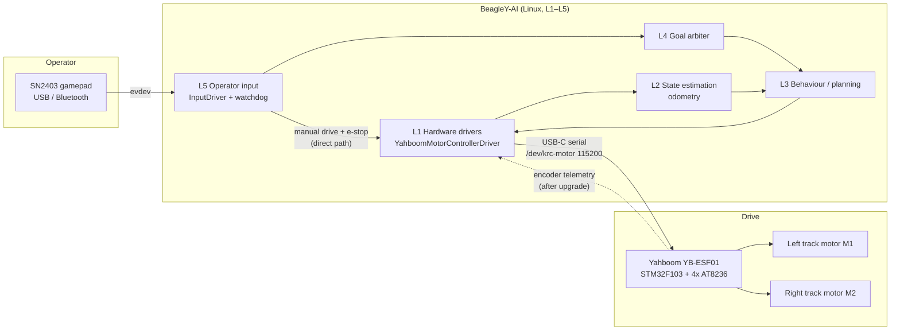
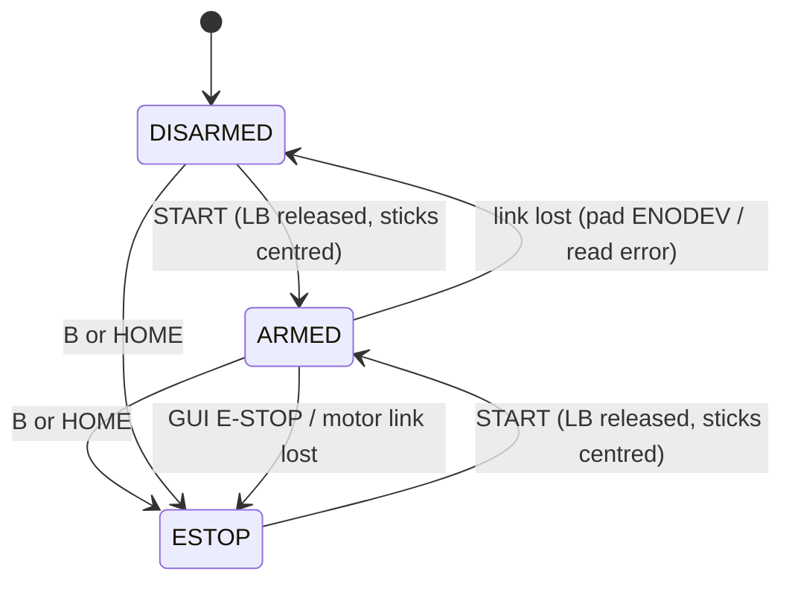
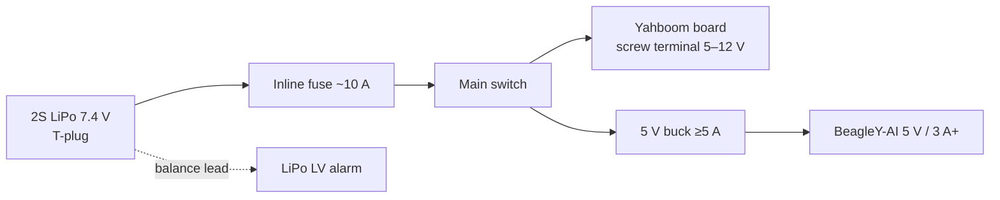
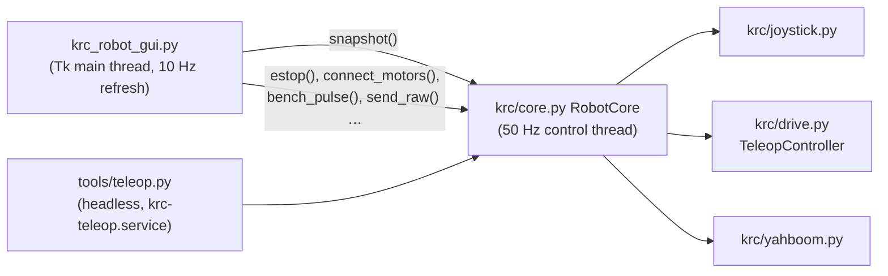

# KR-Robot

KR-Robot is a skid-steer tracked robot. A BeagleY-AI (TI AM67A, Debian 13) runs all the software, and a Yahboom STM32 co-processor drives the motors. This repo holds the software architecture, the design decisions behind it, and the bring-up tooling for Phase 0–1: motor board and joystick teleop.

> **Status (2026-10-01):** Phase 0–1 bring-up. The tooling is deployed and its unit tests pass on the target. Next comes hardware-in-the-loop work: plug in the motor board and the SN2403, and verify the serial protocol. See [docs/bringup.md](docs/bringup.md) for the bench procedure.

---

## 1. System overview

| Item | Part | Notes |
|---|---|---|
| Compute | BeagleY-AI (AM67A) | Runs L1–L5. 3.3 V GPIO only |
| Motor controller | Yahboom 4-ch Encoder Motor Drive Module, YB-ESF01-V2.0 | STM32F103RCT6, AT8236 ×4, CH340K USB-UART, 5–12 V in |
| Drive motors (now) | doit.am 33GB-520-18.7, 12 V, 350 RPM | ×2, **no encoder**, open-loop PWM |
| Drive motors (planned) | Yahboom MD520Z30_12V, 333 RPM 1:30, 11-line hall encoder | Matches Yahboom motor type 1 profile |
| Chassis | Aluminium tracked chassis | Skid-steer, one motor per track |
| Battery | 2S LiPo 7.4 V 5400 mAh 50C | Fuse, switch and LV alarm required (§5) |
| Operator input | SN2403 game controller | Wired XInput, Bluetooth, or 2.4 GHz receiver (not supplied) |

---

## 2. Software architecture: five layers

The layers are ordered from the hardware up. Safety-critical operator commands skip the middle layers.

| Layer | Responsibility | Key interfaces | Phase 0–1 state |
|---|---|---|---|
| **L1 Hardware drivers** | Motor board transport and protocol, encoder readback, future servo/IMU drivers | `IMotorController::setChannelSpeed()`, `YahboomMotorControllerDriver` | Python reference driver in [krc/yahboom.py](krc/yahboom.py) |
| **L2 State estimation** | Wheel odometry from encoder counts, later sensor fusion | encoder `$MAll` / `$MTEP` / `$MSPD` | Blocked until the encoder motors are fitted |
| **L3 Behaviour / planning** | Autonomous behaviours and motion planning | — | Not started |
| **L4 Goal arbiter** | Chooses which source commands motion | — | Not started |
| **L5 Operator input + watchdog** | Gamepad input, arm/deadman/e-stop, link-loss detection | `InputDriver` over evdev | Python reference in [krc/joystick.py](krc/joystick.py) and [krc/drive.py](krc/drive.py) |

### 2.1 Direct path for manual drive and e-stop

Manual drive and e-stop go **straight from L5 to L1**, bypassing L3/L4 and the goal arbiter. A fault or stall in the autonomy stack therefore cannot block a stop command.

### 2.2 Language strategy

- **Bring-up (now): Python 3.** It needs only `python3-serial`, which is already on the image, and gamepad input uses raw evdev `ioctl`s. That makes protocol discovery fast and lets the logic be unit-tested on Windows.
- **Production: C++17.** The C++ L1/L5 classes port the verified Python modules: the same framing, state machine, and tests. The earlier C++ experiments in [motor/](motor/) and [servo/](servo/) set the conventions: CMake, built on the target.

---

## 3. L1: motor board link

### 3.1 Decision: USB-C serial, not I2C

The board can use **either** I2C or UART, not both at once. We use **USB-C to the BeagleY-AI**, because:

- it avoids any 5 V vs 3.3 V logic-level risk on the BeagleY-AI header, whose labelled "5V" pins sit next to 3.3 V-only GPIO
- it avoids uncertainty about the I2C pull-ups
- a udev rule gives the board a stable name, `/dev/krc-motor`, so `ttyUSB` renumbering never matters.

The architecture doc's §2/§8 still assume raw `ioctl` I2C via `I2CDevice`. That is an open item to update.

### 3.2 Protocol

ASCII frames `$cmd:args#` at 115200 8N1. Init sequence, with ~100 ms between commands: motor type, then reduction ratio, then encoder line count, then wheel diameter, then dead zone.

| Command | Meaning | Verified on our board? |
|---|---|---|
| `$mtype:N#` | Motor type 1–4. Type 4 is the no-encoder profile | Documented by Yahboom |
| `$mphase:N#`, `$mline:N#`, `$wdiameter:F#`, `$deadzone:N#` | Profile parameters | Reference-code names, unverified |
| `$upload:A,B,C#` | Enable `$MAll` / `$MTEP` / `$MSPD` reports | Unverified |
| `$pwm:m1,m2,m3,m4#` | Open-loop PWM, assumed ±3600 full scale | **Unverified (Phase 0 blocker)** |
| `$spd:m1,m2,m3,m4#` | Closed-loop speed (encoders only). Some sources say `$speed:` | **Unverified** |

[tools/yahboom_probe.py](tools/yahboom_probe.py) exists to close these gaps. It has `listen`, `raw`, `init` and single-channel `pwm` modes, and both command keywords can be overridden from the CLI.

### 3.3 Control modes

- **Now:** 33GB-520 motors on the 2-pin M1 (left) and M2 (right) ports, open-loop PWM, and no odometry.
- **After the encoder upgrade:** MD520Z30 motors on the 6-pin encoder headers, motor type 1 (reduction 30, 11 lines, 67 mm, dead zone 1900), closed-loop speed, and encoder telemetry feeding L2.

---

## 4. L5: operator input and safety

### 4.1 Joystick connection options, in order of preference

1. **Bluetooth, PC mode, onboard BeagleY-AI radio.** The pad advertises as "Xbox Wireless Controller". The onboard radio is believed to be BLE-only, so this option may not work.
2. **USB Bluetooth Classic dongle.** Pad in PS4 or Switch mode, using `hid-playstation` / `hid-nintendo`.
3. **8BitDo USB Wireless Adapter 2.** The pad appears as a wired Xbox pad (`xpad`).
4. **Wired USB, XInput (`xpad`).** Used for bench work now.

All the required kernel modules (`xpad`, `hid-playstation`, `hid-nintendo`, `btusb`, `uinput`, `ch341`) are present in the stock `6.1.83-ti-arm64` kernel. [krc/joystick.py](krc/joystick.py) reads the axis ranges from the kernel, so every mode normalises to the same −1..+1 values.

### 4.2 Teleop safety state machine ([krc/drive.py](krc/drive.py))

ESTOP stays latched through a gamepad link loss, because it is stricter than DISARMED.

- **Deadman:** output is non-zero only while LB is held. Releasing LB zeroes the output instantly, with no slew.
- **Stopping is easy, re-arming is deliberate.** E-stop latches. Re-arming requires releasing everything and then pressing START.
- **Link loss means a safe stop.** A pad unplug, a Bluetooth drop, or the pad's 5-minute auto-sleep raises `ENODEV`, which disarms the robot. Reconnection is automatic but always comes back DISARMED.
- **Motor link loss** (a serial error) stops the robot and exits teleop.
- The output is re-sent at 50 Hz, the ramp-up is slew-limited, and pivot turns are scaled to 60 % because pivots load the AT8236 drivers hard.
- The bench default caps PWM at `max_pwm=1800`, about 50 % of the assumed full scale, until the full scale is verified.

### 4.3 Future haptics

[krc/joystick.py](krc/joystick.py) supports force-feedback rumble (`EVIOCSFF`). One planned use is haptic confirmation of arm and e-stop events.

---

## 5. Power architecture

- The pack's working range is 6.0–8.4 V, and its minimum is **~6.6 V (3.3 V/cell)**. The board has no low-voltage cutoff, so we need an alarm on the balance lead and/or software monitoring.
- A 50C pack can deliver a very high short-circuit current, so the fuse and switch are mandatory.
- **The BeagleY-AI is never powered from the motor board's 5 V pin.** A separate buck keeps motor noise and brown-outs off the compute rail.
- On 2S, the 12 V motors run at about 60–70 % speed. That is acceptable for teleop, but marginal for closed-loop 520 encoder motors. Moving to 3S (12.6 V) exceeds the board's "12 V" label, so we must **confirm the board's input limit with Yahboom first**.

---

## 6. Future custom hardware (KiCad, `Boards/maindesign`)

Two custom boards are in schematic capture. They will eventually replace the off-the-shelf drive electronics:

- **VIU (vehicle interface unit):** STM32H757 core, LAN8720A Ethernet PHY, isolated CAN-FD (ISO1042), DRV8874 motor drivers, servo PWM, high-side switches, sensors, GPS, a safety circuit, and power input.
- **BMS:** BQ76940 cell-monitor AFE, protection FETs, INA226 current/power monitor, a host MCU with isolated CAN-FD, and a debug interface.

Only the L1 driver changes when the VIU replaces the Yahboom board. `IMotorController` is the seam where the swap happens.

---

## 7. Desktop app: KR-Robot Control

[krc_robot_gui.py](krc_robot_gui.py) is a tkinter app that runs on the BeagleY-AI desktop. Its layout and dark theme match the atr-viu-emulator dashboard. `deploy.ps1` installs a **KR-Robot Control** shortcut on the Xfce desktop and in the application menu.

| Tab | What it does |
|---|---|
| **Drive** | Shows the mode (DISARMED, ARMED or ESTOP) and the deadman state. Has status cards for the gamepad, the motor board and the control loop, plus live L/R track PWM bars and connect/disconnect buttons |
| **Joystick** | Plots both sticks and shows triggers, D-pad, every button with its press count and verified total, all the axes, and the rumble test buttons |
| **Motor board** | Edits the settings (port, PWM keyword, profile, max PWM, turn scale, slew, deadband, expo, tank, inversion) and saves them to `~/.config/krc-robot/settings.json`. Also has a single-channel bench pulse that needs a "tracks off ground" confirmation, `$upload` flags, a raw-frame sender, and the telemetry and unrecognised-frame views |
| **Log** | Shows mode changes, link events, and errors. Can be saved to a file |
| **Diagnostics** | Runs `scripts/krc-diag.sh` and shows its output |

Safety rules in the GUI:

- **SPACE**, **ESC** and the red button are all E-STOP. Buttons never take keyboard focus, so SPACE cannot trigger anything else.
- Re-arming is possible **only from the gamepad** (START).
- A bench pulse is refused while ARMED, and any e-stop cancels it.
- Closing the window sends zero PWM.
- The serial port is opened exclusively, so the GUI and `krc-teleop.service` cannot drive the board at the same time.

`--dry-run` runs the GUI with joystick input only and never opens the motor port.

---

## 8. Repo layout

| Path | Contents |
|---|---|
| [krc_robot_gui.py](krc_robot_gui.py), [images/](images/) | Desktop app and its icon |
| [krc/](krc/) | Python reference drivers: `yahboom.py` (L1), `joystick.py` and `drive.py` (L5), and `core.py` (the shared 50 Hz control loop) |
| [tools/](tools/) | Bench CLIs: `joystick-controller-debug.py`, `joy_test.py`, `yahboom_probe.py`, `teleop.py` |
| [tests/](tests/) | Hardware-free unit tests. Run `python -m unittest discover -s tests` on Windows or the board |
| [scripts/](scripts/) | `krc-diag.sh` (no sudo), `sudo-setup.sh` (one-time root setup) |
| [udev/](udev/), [systemd/](systemd/) | `/dev/krc-motor` rule; `krc-teleop.service`, installed but not enabled |
| [docs/bringup.md](docs/bringup.md) | Bench bring-up procedure and controls |
| [motor/](motor/) | Earlier C++ TB6612 driver (sysfs GPIO + PWM). Superseded by the Yahboom board |
| [servo/](servo/) | Earlier C++ PCA9685 servo driver over `/dev/i2c-*` |
| `deploy.ps1`, `remote-setup.sh` | Deploy from Windows to `beagle@192.168.1.116:~/krc-robot` |

### Development workflow

- Edit on Windows in VS Code. Run `.\deploy.ps1`, then use the tools over SSH (`ssh -t` for the curses dashboard), or open the board directly with Remote-SSH.
- Recommended VS Code extensions: C/C++ and CMake Tools, Remote-SSH, Python, Serial Monitor, Markdown All in One, markdownlint, Markdown Mermaid (which renders the diagrams in this file), and DeviceTree (for AM67A overlays).

---

## 9. Roadmap and open items

### Phase 0: protocol and hardware

- [ ] Verify the `$pwm` / `$spd` keywords, the PWM full scale, and whether the board has a command timeout (`yahboom_probe.py`)
- [ ] Find the real dead zone of the 33GB-520s and the track direction signs
- [ ] Separate the motor leads and wire them to the M1/M2 2-pin ports
- [ ] Build the T-plug pigtail, ~10 A fuse and main switch. Fit the LiPo alarm. Source a 5 V ≥5 A buck
- [ ] Confirm the board's maximum input voltage with Yahboom before any move to 3S

### Phase 1: teleop

- [ ] Verify the SN2403 wired, then over Bluetooth (onboard radio, then the dongle fallbacks)
- [ ] Bench teleop on blocks, then on the ground. Enable `krc-teleop.service` afterwards
- [ ] Contact the seller about the SN2403 2.4 GHz receiver

### Phase 2 and later

- [ ] Port L1/L5 to C++ behind `IMotorController` / `InputDriver`
- [ ] Fit the encoder motors (check mechanical fit first), switch to closed-loop speed, add L2 odometry
- [ ] Update the architecture doc §2/§8 for USB-serial transport
- [ ] Bring up L3/L4, then the VIU and BMS custom hardware

## References

- Yahboom 4-channel driver, USART: <https://www.yahboom.net/public/upload/upload-html/1740817239/4%20channel%20encoder%20motor%20driver%20module-USART.html>
- Yahboom, drive motor and read encoder (IIC): <https://www.yahboom.net/public/upload/upload-html/1740656355/Drive%20motor%20and%20read%20encoder-IIC.html>
- Yahboom product and download page: <https://www.yahboom.net/study/Quad-MD-Module>
- Yahboom MD520 motor: <https://category.yahboom.net/products/md520>
- Community ROS 2 bridge for the same board (`$mtype`, `$speed`, `$read`): <https://dev.to/shaifurcodes/building-a-ros-2-hardware-bridge-for-yahboom-520-motor-drivers-without-serial-conflicts-cmb>
