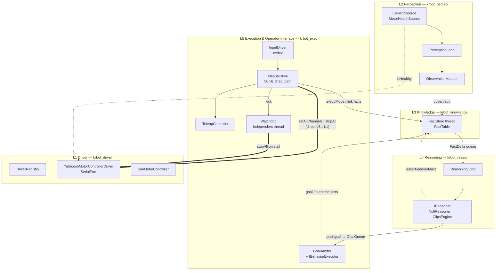

# KR-bot system design: first cut

| | |
|---|---|
| Status | First cut, 2026-10-02. It covers the first increment of the C++ stack in [krbot/](../krbot/) |
| Source of truth | **Design doc v3**, "KR-bot Agentic Software Architecture" (5-layer, C++, CLIPS-based L4). It lives at `Engineering/Projects/KRC-Robot/Design/knowledge-agent-architecture.md`, outside this repo |
| Also drawn from | [README.md](../README.md), the motor/joystick design note ([notes/kr-robot-motor-control-and-joystick.md](../notes/kr-robot-motor-control-and-joystick.md)), [notes/bluetooth-debugging.md](../notes/bluetooth-debugging.md) |
| Framework decision | Plain C++20 and CMake now, with ROS 2 later as a bridge (§8). Built natively on the BeagleY-AI |

This document maps doc v3 onto code. Where the two disagree, doc v3 wins unless the difference is listed in §7 as a deliberate deviation.

---

## 1. Layers, modules and build targets



| Layer (doc v3) | Library | Directory | Classes | Increment 1 |
|---|---|---|---|---|
| L1 Driver / Controller (§2) | `krbot_driver` | `src/driver/` | `IMotorController`, `IDistanceSensor`, `YahboomMotorControllerDriver`, `YahboomProtocol`, `SerialPort`, `I2CDevice`, `SimMotorController`, `DriverRegistry` | **Real** |
| L2 Perception (§3) | `krbot_percep` | `src/percep/` | `Observation`, `ISensorSource`, `ObservationMapper`, `PerceptionLoop`, `MotorHealthSource` | Skeleton plus a motor-health source |
| L3 Knowledge (§4) | `krbot_knowledge` | `src/knowledge/` | `Fact`, `FactDelta`, `FactTable`, `FactStore` | Working (in memory) |
| L4 Reasoning (§5) | `krbot_reason` | `src/reason/` | `Goal`, `GoalQueue`, `IReasoner`, `ReasoningLoop`, `NullReasoner` | Stub engine; the sync path is real |
| L5 Execution (§6) | `krbot_exec` | `src/exec/` | `ManualDrive`, `TeleopController`, `InputDriver`, `Watchdog`, `GoalArbiter`, `IBehaviorExecutor`, `StubExecutor` | **Real** for teleop, watchdog and arbiter; the BT executor is a stub |
| core (§9) | `krbot` (exe) | `src/core/` | `App`, `main` | Real |
| common | `krbot_common` | `src/common/` | `ThreadSafeQueue`, `Config`, `Log` | Real |

**Dependency rule:** libraries depend only on layers below them, or on `common`. L2 depends on L3 because the observation→fact mapping lives at the L2→L3 boundary (doc v3 §3). L5 depends on L4 only for the `Goal` type. `DriverRegistry` is the only code that names concrete driver types (doc v3 §2).

---

## 2. Threads and queues (doc v3 §7)

| Thread | Owner | Rate | Talks to |
|---|---|---|---|
| `ManualDrive` | L5 | 50 Hz, fixed deadline | `InputDriver` (in the same thread), `IMotorController` (direct), `Watchdog::kick`, `FactStore` (commands) |
| `Watchdog` | L5 | timeout/4 (50 ms) | `IMotorController::stopAll` (direct), `ManualDrive::requestEstop` |
| Arbiter loop | core / L5 | 20 Hz | `GoalQueue` (drain), `FactStore` (outcomes) |
| `ReasoningLoop` | L4 | 20 Hz | `FactDelta` queue (drain), `IReasoner`, `GoalQueue` (push) |
| `FactStore` | L3 | event-driven, plus 10 Hz TTL sweep | Command queue (in), `FactDelta` queue (out) |
| `PerceptionLoop` | L2 | 10 Hz | `ISensorSource::poll`, `FactStore` (commands) |
| Yahboom RX | L1 | blocking read with 50 ms poll | parses `$MAll`/`$MTEP`/`$MSPD` into telemetry under a mutex |

- **No thread locks another layer's data.** Every hand-off goes through a `common::ThreadSafeQueue`. The `FactStore` table is only touched by its own thread; reads are commands that carry a promise.
- **L4 ticks are strictly phased** (doc v3 §5.3): drain the deltas, then `syncDelta` each one, then run a bounded `tick(runLimit)`. A tick that hits `runLimit` is counted and logged as a possible runaway rule pair.
- **Deviation:** doc v3 has a global `g_goalQueue`. Here the `GoalQueue` is owned by `core::App` and handed to the reasoner's outputs and to the arbiter (§7).

---

## 3. Key interfaces

```cpp
// L1 — doc v3 §2, plus setAllChannels (deviation D2)
class IMotorController {
    virtual void setChannelSpeed(uint8_t channel, int16_t speed) = 0;   // 1-based M1..M4
    virtual void setAllChannels(const std::array<int16_t,4>&) = 0;     // one frame per tick
    virtual void stopAll() = 0;
    virtual bool isHealthy() const = 0;
};
class IDistanceSensor { virtual std::optional<float> readDistanceMeters() = 0; };

// L2
class ISensorSource { virtual std::vector<Observation> poll() = 0; };

// L3 — tuple shape mirrors the generic CLIPS `fact` deftemplate (doc v3 §5.2)
struct Fact { FactId id; std::string subject, predicate; std::variant<std::string,double> object;
              double confidence; time_point timestamp; FactSource source; milliseconds ttl; };
struct FactDelta { enum class Op { Assert, Retract, Modify } op; Fact fact; };

// L4 — the ClipsEngine seam (doc v3 §5.1/§5.3)
class IReasoner { virtual void syncDelta(const FactDelta&) = 0; virtual long long tick(int runLimit) = 0; };
struct ReasonerOutputs { std::function<void(Goal)> postGoal; std::function<void(Fact)> assertDerived; };

// L5 — the BehaviorTree.CPP seam (doc v3 §6)
class IBehaviorExecutor { virtual BtStatus tick() = 0; virtual void halt() = 0; };
using ExecutorFactory = std::function<std::unique_ptr<IBehaviorExecutor>(const Goal&)>;
```

**`FactStore` write semantics:**
- **`upsert`** is for functional facts, where each subject+predicate has one value (`robot teleopMode`, `motorBoard linkHealthy`). A second upsert emits **Modify**, which `ClipsEngine` applies as retract followed by reassert (doc v3 §5.3).
- **`add`** is for multi-valued facts (`obstacleN distanceTo`).
- Facts with a TTL are swept every 100 ms, and each expiry emits **Retract**.

---

## 4. Safety architecture

These are the hard rules. All of them are covered by unit tests in `krbot/tests/`.

1. **Direct path.** Manual drive and e-stop go from L5 straight to L1 (`ManualDrive` → `IMotorController`), never through L3/L4 or the arbiter (doc v3 §6).
2. **Teleop state machine** (`TeleopController`, a 1:1 port of `krc/drive.py` with the same test cases):
   - The robot starts **DISARMED**.
   - ARM needs START, with LB released and the sticks centred.
   - Output is produced only while the deadman (LB) is held. Releasing it zeroes the output instantly, with no slew.
   - **ESTOP** can be triggered by B/HOME, the GUI, the watchdog, or a motor fault. It latches, survives link loss, and is cleared only by re-arming with START.
3. **Gamepad link loss** (`ENODEV`, POLLHUP, EOF): ARMED drops to DISARMED. Reconnection is automatic, but the robot always comes back DISARMED.
4. **Motor fault.** If `isHealthy()` is false (open failed, read or write error, device gone), ESTOP is **held every tick**. Pressing START cannot arm the robot while the board is down. Nothing is written to an unhealthy controller.
5. **Watchdog** (doc v3 §6, "the only hard safety backstop"):
   - It runs in its own thread, and the control loop kicks it every tick.
   - If the loop misses the 200 ms timeout, the watchdog calls `IMotorController::stopAll()` **directly**, independent of every other thread, and asks `ManualDrive` to latch ESTOP.
   - It trips once per stall.
6. **Shutdown order:** `ManualDrive` stops first and zeros the motors, then the watchdog, the arbiter, L4, L2 and L3, then a final `stopAll()`. SIGINT and SIGTERM both take this path.
7. **One process drives the board.** `SerialPort` takes `flock(LOCK_EX)`, the same lock pyserial's `exclusive=True` uses. The C++ stack, the Python desktop app and `tools/teleop.py` therefore cannot command the motors at the same time; the second one gets "in use".
8. **DTR/RTS are held low** on open, so the CH340 auto-reset circuit doesn't reset the STM32.
9. **Output clamp.** `motor.max_output` (default 1800 of an assumed ±3600) is enforced in the driver, below every caller.

---

## 5. Configuration

[krbot/config/krbot.conf](../krbot/config/krbot.conf) is an INI-style file. Any key can be overridden as `--section.key=value`, and `--dry-run` forces `motor.driver=sim`. The teleop tuning defaults match the Python desktop app. Settings are not yet shared with `~/.config/krc-robot/settings.json` (that is an open item).

---

## 6. Build, test and run

```bash
# on the BeagleY-AI (deploy.ps1 ships krbot/ with everything else)
bash ~/krc-robot/scripts/build-krbot.sh          # cmake + ninja + ctest (39 tests)
~/krc-robot/krbot/build/krbot --dry-run           # real gamepad, simulated motors
~/krc-robot/krbot/build/krbot                     # real motor board (close the desktop app first)
~/krc-robot/krbot/build/krbot --teleop.max_output=1200 --log=debug
```

**Toolchain on the target:**
- Debian 13 with g++ 14.2 (C++20), CMake 3.31, Ninja and GoogleTest 1.16 (from apt).
- The build uses `-Wall -Wextra -Wpedantic -Wshadow -Wconversion` and is warning-clean.

**Verified 2026-10-02 on the board:**
- **Dry run:** found the wired SN2403 (`045e:028e`), held 50 Hz, the watchdog stayed quiet, and SIGINT stopped it with "motors zeroed".
- **Real mode with no board attached:** fell back to `/dev/ttyUSB0`, used an unhealthy placeholder, latched ESTOP ("motor link lost"), and kept running and reporting.

---

## 7. Deviations from Design doc v3

| # | Doc v3 says | Implemented | Why |
|---|---|---|---|
| D1 | §2/§8: Yahboom over I2C (`MCU_I2C0`, pins 3/5), via `I2CDevice` | **USB-C serial** (CH340K), `SerialPort`, ASCII `$cmd:args#` at 115200 | Design note §2.3: avoids 5 V vs 3.3 V logic-level risk and I2C pull-up uncertainty. `I2CDevice` is kept for I2C sensors |
| D2 | §2: `IMotorController` has `setChannelSpeed`, `stopAll`, `isHealthy` | Adds **`setAllChannels(array<int16_t,4>)`** | The board takes all four channels in one frame. That means one write per tick, and left/right change atomically |
| D3 | §5.4: global `g_goalQueue` | `GoalQueue` owned by `core::App` and injected | Testability, and no hidden global state |
| D4 | §6: `Goal` struct in L5 | `Goal` is defined in `reason/` (L4) | L4 posts goals, so the type sits with the producer and library dependencies point downward |
| D5 | §10 Phase 0: implement `UltrasonicSensorDriver` | Interface only (`IDistanceSensor`) | The transport (GPIO vs I2C) is still open (doc v3 §11) |
| D6 | §5 CLIPS, §6 BehaviorTree.CPP | `NullReasoner` and `StubExecutor` behind `IReasoner` / `IBehaviorExecutor`. CMake options `KRBOT_WITH_CLIPS` / `KRBOT_WITH_BTCPP` are reserved | Neither library is packaged for Debian 13, so they will be vendored in Phase 1 (`FetchContent`) |
| D7 | — | The L1 registry installs an *unhealthy placeholder* if the board can't be opened | The stack still starts and reports the fault, and teleop holds ESTOP. Reconnecting needs a restart for now |
| D8 | §6: "Xbox link" | Generic evdev `InputDriver` | Works with the SN2403 wired (xpad) and over BLE (hid-microsoft). Axis ranges come from the kernel |

D1 and D2 should be folded back into doc v3 §2 and §8.

---

## 8. ROS 2 later (bridge, not rewrite)

The plan is to keep the core free of middleware and add a `krbot_ros2` bridge (`rclcpp`) when navigation work starts:

| krbot seam | ROS 2 mapping |
|---|---|
| `FactDelta` queue (L3→L4) | `/krbot/facts` topic (custom msg mirroring `Fact`) and a `/krbot/query_facts` service |
| `GoalQueue` (L4→L5) | `/krbot/goals` topic, or a `krbot/ExecuteGoal` action |
| Task outcome facts | Action result and feedback |
| `ManualDrive` status | `/krbot/teleop_status`. **Manual drive stays native.** The safety path never goes through DDS |
| `IMotorController` | `ros2_control` hardware interface wrapping the same driver, if `nav2` is adopted |

**Blocker:** Debian 13 (trixie) on arm64 has no official ROS 2 binaries, so the bridge needs a source build or a container on the BeagleY-AI.

---

## 9. Phasing against doc v3 §10

| Phase | Doc v3 scope | Status |
|---|---|---|
| 0 | Yahboom protocol and `YahboomMotorControllerDriver`, `UltrasonicSensorDriver` | Driver **done** (serial). Protocol keywords and full scale still **unverified on the bench**. Ultrasonic not started |
| 1 | L2 sensing, minimal `FactStore`, safety-band CLIPS rules (obstacle stop) driving `HoldPosition`/`Idle` BTs | `FactStore` and L2 skeleton **done**. Next: vendor CLIPS and BT.CPP, add `ClipsEngine` and `BtExecutor`, then the first `obstacle-close-stop` rule |
| 2 | Remaining sensors/actuators; expand the rule set | — |
| 3 | Tasking rules, multi-goal arbitration, full BT library | Arbiter pre-emption with hysteresis is already in place and tested |
| 4 | SQLite episodic persistence and long-term promotion | — |

## 10. Open items

- [ ] Verify the Yahboom `$pwm`/`$spd` keywords, the PWM full scale, and the board's command timeout on the bench, then remove the "UNVERIFIED" markers
- [ ] Phase 1: `ClipsEngine` (CLIPS 6.4 via FetchContent, AddRouter → `Log`), `BtExecutor` (BehaviorTree.CPP 4), and the `trees/hold_position.xml` and `idle.xml` trees
- [ ] Reconnect the motor board without a restart: let `DriverRegistry` retry the open, while ESTOP stays latched until re-arm
- [ ] Share teleop tuning between `krbot.conf` and the desktop app's `settings.json`, or make the desktop app a front-end to `krbot`
- [ ] `systemd/krbot.service`, once bench-tested. It replaces `krc-teleop.service`
- [ ] Fold deviations D1 and D2 back into Design doc v3 §2/§8
