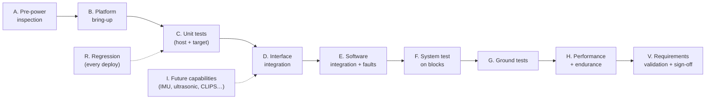

# KR-Robot test and validation plan

| | |
|---|---|
| Scope | Verification and validation of the KR-Robot from first power-up and integration, through subsystem and system testing on the bench and the ground, to validation of the requirements in the system design |
| Status | Rev A, 2026-10-02. The statuses below reflect evidence gathered on the robot up to this date |
| System under test | BeagleY-AI (Debian 13, kernel `6.1.83-ti-arm64-r72`), `krbot` 0.1.0 (C++20 5-layer stack), Yahboom YB-ESF01 on the header UART (`/dev/ttyAMA0`), 2× 33GB-520 track motors, SN2403 gamepad, 2S LiPo |
| Requirement sources | Design doc v3 (`Design/knowledge-agent-architecture.md`), [system-design.md](system-design.md), [wiring-manual.md](wiring-manual.md), [bringup.md](bringup.md), [../notes/kr-robot-motor-control-and-joystick.md](../notes/kr-robot-motor-control-and-joystick.md) (design note), [../README.md](../README.md) |

---

## 1. How to use this document

1. **Work through the phases in order** (§4). Each phase's entry criteria must be met before it starts, and a phase **fails** if any test marked **Must** fails.
2. For every test, record the **status**, the **date** and the **evidence**: the command output, the log line, a photo, or a measurement. Evidence references go in the Evidence column. Put large artefacts under `notes/test-records/YYYY-MM-DD-<phase>.md` (§8).
3. **When a test fails:** stop and make the robot safe (E-stop, then main switch). Raise an issue, fix it, and re-run the test plus its regression set (§4.10).
4. **Keep §6 (traceability) current.** A requirement is **validated** only when every test case linked to it has passed.

**Status values:**

| Status | Meaning |
|---|---|
| **PASS** | Passed, with evidence recorded |
| **FAIL** | Failed, with an issue raised |
| **OPEN** | Not run yet |
| **BLOCKED** | Can't run yet (hardware not fitted, or a dependency is open) |
| **N/A** | Not applicable to this build |

**Verification methods (V-method):**

| Code | Method |
|---|---|
| **I** | Inspection: look at, measure, or read the configuration or code |
| **A** | Analysis: calculation or review |
| **D** | Demonstration: operate it and observe |
| **T** | Test: an instrumented or automated test with pass/fail criteria |

**Priority:** **Must** (safety or core function), **Should** or **Could**.

---

## 2. Test levels and flow



| Level | Where | Who / what |
|---|---|---|
| A, B | Bench, robot unpowered or BeagleY-AI only | Inspection and configuration |
| C | Windows PC (Python) and BeagleY-AI (C++, Python) | `ctest`, `python -m unittest` |
| D, E | Bench. **Motors run only with the tracks off the ground** | Probe tools, `krbot`, KR-bot Monitor |
| F | Robot **on blocks** | Gamepad teleop, monitor, fault injection |
| G | **On the ground** in a clear area, with a spotter at the main switch | Driving tests |
| H | Bench and ground | Soak, timing, thermal |
| V | Review | §6 traceability, sign-off (§7) |

---

## 3. Requirements register

These requirements were derived for verification from the sources listed. They are written as "shall" statements. IDs are stable: add new ones at the end of each group and never renumber.

### 3.1 Safety (SAF)

| ID | Requirement | Source | V-method | Priority |
|---|---|---|---|---|
| REQ-SAF-01 | The robot shall start **DISARMED** with zero motor output, after power-up and after every software restart | system-design §4.2, README §4.2 | T, D | Must |
| REQ-SAF-02 | Arming shall need START with the deadman (LB) released and the sticks centred, and shall be possible **only from the gamepad** | system-design §4.2, §6a | T, D | Must |
| REQ-SAF-03 | Motor output shall be non-zero **only while the deadman (LB) is held**. Releasing it shall zero the output on the next control tick, with no slew limit | system-design §4.2 | T, D | Must |
| REQ-SAF-04 | B/HOME, the GUI, the KR-bot Monitor, `SIGUSR1`, the watchdog and a motor fault shall each latch **ESTOP**. ESTOP shall survive gamepad link loss and be cleared only by re-arming with START | system-design §4.2 | T, D | Must |
| REQ-SAF-05 | Gamepad link loss (unplug, BT drop, sleep) shall drop ARMED to DISARMED with zero output. Reconnecting shall not resume motion | design note §6.2, system-design §4.3 | T, D | Must |
| REQ-SAF-06 | A motor-link fault shall hold ESTOP **every tick**. START shall not arm while the link is unhealthy, and nothing shall be written to an unhealthy controller | system-design §4.4 | T, D | Must |
| REQ-SAF-07 | If the control loop stalls for **> 200 ms**, the watchdog shall call `stopAll()` directly from its own thread and latch ESTOP | Design doc v3 §6, system-design §4.5 | T | Must |
| REQ-SAF-08 | Shutdown (SIGINT/SIGTERM, a service stop, closing an app) shall zero the motors before anything else stops | system-design §4.6 | T, D | Must |
| REQ-SAF-09 | Only one process shall be able to command the motor board at a time (exclusive port lock) | system-design §4.7 | T | Must |
| REQ-SAF-10 | Motor output shall be clamped to `max_output` (bench default 1800 of ±3600) in the driver, below every caller | system-design §4.9 | T, I | Must |
| REQ-SAF-11 | No remote interface shall be able to arm or drive the robot. The monitor accepts `estop` and `ping` only | system-design §6a | T | Must |
| REQ-SAF-12 | A hardware E-stop input (NC switch, pulled up) shall latch ESTOP, and hold it while pressed or while its wire is broken | wiring-manual §5.6 | T, D | Must (when fitted) |
| REQ-SAF-13 | The motor-board command stream shall be held at zero, or stopped safely, if `krbot` freezes completely (all threads). *This is the hazard covered by TC-E-12* | Hazard identified in this plan | T, A | Must |
| REQ-SAF-14 | The motor rail shall be protected by a ~10 A fuse and a main switch. The battery shall have a low-voltage alarm | design note §4.1, README §5 | I | Must |

### 3.2 Functional (FUN)

| ID | Requirement | Source | V-method | Priority |
|---|---|---|---|---|
| REQ-FUN-01 | Arcade mixing: left stick Y gives throttle, right stick X gives steer. An optional tank mode is available | system-design §4.2 | T, D | Must |
| REQ-FUN-02 | Output ramp-up shall be slew-limited (`slew_per_s`). Pivot turns shall be scaled by `turn_scale` (0.6) | README §4.2 | T | Should |
| REQ-FUN-03 | Stick forward shall move the robot forward, and right stick right shall turn it right (correct track inversion) | wiring-manual §5.1, bringup §3.5 | D | Must |
| REQ-FUN-04 | The left track shall be driven by Yahboom **M1** and the right by **M2**. M3 and M4 are unused | wiring-manual §5.1 | D, I | Must |
| REQ-FUN-05 | The motor board shall be initialised with motor profile `33gb520` (`$mtype:4#`, `$deadzone:1000#`) on connect | README §3.2 | T, I | Should |
| REQ-FUN-06 | The L1–L5 stack shall run as specified in doc v3: L3 FactStore single-owner, phased L4 tick, arbiter with hysteresis, outcome facts | Design doc v3 §4–§7 | T | Must |
| REQ-FUN-07 | `krbot` shall run as a user service, controllable without sudo, and come up DISARMED on every (re)start | system-design §6a | D | Must |

### 3.3 Interfaces (IF)

| ID | Requirement | Source | V-method | Priority |
|---|---|---|---|---|
| REQ-IF-01 | Motor link: ASCII `$cmd:args#` at 115200 8N1 on the header UART `/dev/ttyAMA0` (as built). USB-C `/dev/krc-motor` is the fallback | wiring-manual §5.1/§5.1b | T | Must |
| REQ-IF-02 | The Yahboom board shall accept `$pwm:m1,m2,m3,m4#`, and report `$MAll` when `$upload` is enabled | README §3.2 | T | Must |
| REQ-IF-03 | Gamepad: SN2403 in PC/XInput mode, wired (`xpad`). BLE when the pairing test passes | README §4.1 | D | Must (wired) |
| REQ-IF-04 | Header electrical: 3.3 V logic only, no 5 V back-feed, common ground, and the Yahboom TX2 ≤ 3.3 V into pin 10 | wiring-manual §1, §5.1b | I | Must |
| REQ-IF-05 | Monitor protocol v1: line-delimited JSON over TCP `127.0.0.1:5765`, with hello, log replay, status at 10 Hz and live logs | system-design §6a | T | Must |
| REQ-IF-06 | I2C1 sensor bus `/dev/i2c-1` (pins 3/5), with the address map in wiring-manual §5.3 | wiring-manual §5.3 | T | Should (when fitted) |

### 3.4 Performance (PERF)

| ID | Requirement | Source | V-method | Priority |
|---|---|---|---|---|
| REQ-PERF-01 | The manual-drive control loop shall run at **50 Hz ± 2 %**, including with no gamepad connected | system-design §2 | T | Must |
| REQ-PERF-02 | The control loop shall never block on I/O. Gamepad discovery and the monitor run on separate threads | system-design §2, §4.10 | T, A | Must |
| REQ-PERF-03 | `krbot` CPU use shall be < 10 % of one core when idle, and memory shall be stable over a 1 h soak | This plan | T | Should |
| REQ-PERF-04 | Gamepad → motor-command latency shall be ≤ 60 ms (3 ticks) | This plan (derived from 50 Hz) | T | Should |
| REQ-PERF-05 | The monitor shall never slow the control loop (slow clients are dropped). Up to 8 clients | system-design §6a | T | Must |

### 3.5 Operability, power and build quality (OPS / PWR / SWQ)

| ID | Requirement | Source | V-method | Priority |
|---|---|---|---|---|
| REQ-OPS-01 | KR-bot Monitor shall show mode, deadman, outputs, gamepad, motor, watchdog and layer status, and shall send E-STOP | system-design §6a | D | Must |
| REQ-OPS-02 | The robot shall be observable from the PC through an SSH tunnel, with no firewall change | system-design §6a | D | Should |
| REQ-OPS-03 | `krc-diag.sh` shall report motor serial, gamepad and Bluetooth state without sudo | bringup §3.1 | D | Should |
| REQ-PWR-01 | The BeagleY-AI shall be powered from its own 5 V ≥ 5 A buck, never from the Yahboom 5 V pin | README §5 | I | Must |
| REQ-PWR-02 | Battery voltage shall be monitored: warn below 7.0 V, stop below 6.6 V (INA226, when fitted) | wiring-manual §5.7 | T | Should |
| REQ-SWQ-01 | The C++ build shall be warning-clean (`-Wall -Wextra -Wpedantic -Wshadow -Wconversion`), and all unit tests shall pass on the target | system-design §6 | T | Must |
| REQ-SWQ-02 | The Python bench tools shall have unit tests that pass on Windows and on the target | README §8 | T | Should |
| REQ-SWQ-03 | Files deployed to the board shall have LF line endings, and docs shall pass markdownlint | README §8 | I | Should |

---

## 4. Test checklists by phase

### 4.1 Phase A: Pre-power inspection (robot unpowered)

**Entry criteria:** wiring complete per the wiring manual, battery charged, and the main switch OFF.

| TC | Check | Expected / pass criteria | Req | M | Status | Evidence |
|---|---|---|---|---|---|---|
| TC-A-01 | Fuse (~10 A) and main switch are in the battery + line before the Yahboom terminal | Present, correct rating | SAF-14 | I | OPEN | |
| TC-A-02 | LiPo low-voltage alarm is on the balance lead | Fitted, beeps at its set point | SAF-14 | I | OPEN | |
| TC-A-03 | BeagleY-AI power comes from its own 5 V buck through USB-C. The Yahboom "5V" pin is **unconnected** | Continuity check: no link from the Yahboom 5V to BeagleY 5V | PWR-01, IF-04 | I | OPEN | |
| TC-A-04 | Header UART wiring: pin 8 → Yahboom RX2, pin 10 ← Yahboom TX2, pin 6 to GND | Matches wiring-manual §5.1b | IF-01, IF-04 | I | OPEN | |
| TC-A-05 | **Yahboom TX2 idle voltage**, measured with the Yahboom powered and the BeagleY pin 10 disconnected | **≤ 3.3 V** (otherwise fit a level shifter) | IF-04 | I | **OPEN, Must do** | |
| TC-A-06 | Motors on the **2-pin M1 (left) and M2 (right)** ports. Nothing on the 6-pin encoder headers or M3/M4 | Visual check | FUN-04 | I | OPEN | |
| TC-A-07 | Common ground: battery −, Yahboom GND, buck GND and BeagleY GND are all at one point | Continuity check | IF-04 | I | OPEN | |
| TC-A-08 | Motor leads routed away from signal wiring, with strain relief | Visual check | — | I | OPEN | |

### 4.2 Phase B: Platform bring-up (BeagleY-AI powered, motor board powered, robot on blocks)

| TC | Check | Expected / pass criteria | Req | M | Status | Evidence |
|---|---|---|---|---|---|---|
| TC-B-01 | `deploy.ps1` completes; `remote-setup.sh` reports the groups OK | `dialout`, `input`, `i2c`, `gpio` present | — | D | **PASS** 2026-10-02 | deploy logs |
| TC-B-02 | `sudo-setup.sh --bluetooth` done: udev rule, `krc-ble-enable` enabled | `hci0` present | IF-03 | D | **PASS** 2026-10-01 | bluetooth-debugging.md |
| TC-B-03 | BLE survives a reboot | `krc-ble-enable` active, `hci0` registered | IF-03 | T | **PASS** 2026-10-02 | full reboot |
| TC-B-04 | Overlays: `uart-ttyama0` added, and `main-uart1-default-pins` claimed after the reboot | `/dev/ttyAMA0` → `ttyS3`, pins 107/108 claimed | IF-01 | T | **PASS** 2026-10-02 | pinmux-pins |
| TC-B-05 | **Decide on, then apply,** the `mcp2515-can0.dtbo` overlay (loaded, but no chip fitted) | Decision recorded. Removed unless a CAN HAT is fitted | — | I | OPEN | |
| TC-B-06 | `krc-diag.sh` | Motor serial, gamepad and Bluetooth all OK | OPS-03 | D | OPEN (re-run on UART) | |
| TC-B-07 | `build-krbot.sh` on the target | Builds; 43/43 tests pass; no warnings | SWQ-01 | T | **PASS** 2026-10-02 | ctest |

### 4.3 Phase C: Unit tests (every change, host and target)

| TC | Check | Expected | Req | M | Status | Evidence |
|---|---|---|---|---|---|---|
| TC-C-01 | C++ `ctest` on the target (protocol, safety, axis, FactTable/Store, arbiter, watchdog, ManualDrive, monitor) | 43/43 pass | SWQ-01, SAF-01…11, FUN-06 | T | **PASS** 2026-10-02 | `100% tests passed … 43` |
| TC-C-02 | Python `unittest` on Windows | All pass (Linux-only tests skipped) | SWQ-02 | T | **PASS** 2026-10-02 | `OK (skipped=10)` |
| TC-C-03 | Python `unittest` on the target | All pass | SWQ-02 | T | **PASS** 2026-10-02 | `OK` |
| TC-C-04 | Lint: `pyflakes` on the apps; `markdownlint-cli2` on the docs | Clean | SWQ-03 | I | **PASS** 2026-10-02 | |
| TC-C-05 | No CRLF in deployed scripts (`grep -lU $'\r'`) | None | SWQ-03 | I | **PASS** 2026-10-02 | |

The safety unit tests that back the Phase F demonstrations are:

- `TeleopSafety.*` (start disarmed, arm refused, deadman, slew, e-stop latch, link loss, inversion)
- `ManualDrive.*` (writes channels, external e-stop, unhealthy motors block arming)
- `Watchdog.*` (trip once, real stall)
- `MonitorServer.*` (`arm` rejected)

### 4.4 Phase D: Interface integration

#### IF-01 Motor board (header UART). **Tracks off the ground. `krbot` stopped for D-01…D-04**

| TC | Check | Expected | Req | M | Status | Evidence |
|---|---|---|---|---|---|---|
| TC-D-01 | `yahboom_probe.py --port /dev/ttyAMA0 listen -t 3` | Port opens; no garbage | IF-01 | T | **PASS** 2026-10-02 | `Opened /dev/ttyAMA0 @ 115200` |
| TC-D-02 | `raw '$upload:1,0,0#'`, then `raw '$upload:0,0,0#'` | `$MAll:…` frames stream, then stop | IF-01, IF-02 | T | **PASS** 2026-10-02 | `RX $MAll:0,0,0,0#` |
| TC-D-03 | `$pwm` accepted: drive M1 and M2 | Both tracks turn | IF-02, FUN-04 | D | **PASS** 2026-10-02 | operator confirmed; `krbot` log shows ±1800 on L and R |
| TC-D-04 | M3 / M4 pulses (`pwm 3 600`, `pwm 4 600`) | **Nothing moves** | FUN-04 | D | OPEN | |
| TC-D-05 | **Dead zone:** raise `pwm 1 N` from 0 in steps of 50 until the track moves | Record N. Set `$deadzone` / the deadband if needed | FUN-05 | T | OPEN | |
| TC-D-06 | **Full scale:** confirm ±3600 = 100 % (measure track rpm at 1800 vs 3600 *briefly*) | Ratio ~0.5. Remove the "UNVERIFIED" markers | SAF-10, IF-02 | T | OPEN | |
| TC-D-07 | **Board command timeout:** `raw '$pwm:600,0,0,0#'` once, then send nothing for 5 s | Record whether the board stops by itself (and after how long) or keeps running. Feeds TC-E-12 | SAF-13 | T | OPEN | |
| TC-D-08 | Exclusive lock: with `krbot` running, run `yahboom_probe.py --port /dev/ttyAMA0 listen` | Probe fails with "in use" (or "Resource busy") | SAF-09 | T | OPEN | |

#### IF-02 Gamepad

| TC | Check | Expected | Req | M | Status | Evidence |
|---|---|---|---|---|---|---|
| TC-D-10 | Wired PC/XInput: `joystick-controller-debug.py` | `045e:028e`, every button and axis verified, rumble works | IF-03 | D | **PASS (enumeration)** 2026-10-01. Full checklist OPEN | |
| TC-D-11 | Rest drift with the sticks released | Below the 0.08 deadband | FUN-01 | T | OPEN | |
| TC-D-12 | BLE pairing (`bt-pair-gamepad.sh`) | Pad appears in the LE scan and connects. Otherwise use a fallback | IF-03 | D | OPEN | |

#### IF-05 Monitor

| TC | Check | Expected | Req | M | Status | Evidence |
|---|---|---|---|---|---|---|
| TC-D-20 | Raw stream: `nc 127.0.0.1 5765`, or the Python check | hello, then replay, then status at 10 Hz, then logs | IF-05 | T | **PASS** 2026-10-02 | |
| TC-D-21 | `{"cmd":"estop"}` is acknowledged and latches | `ack`, mode ESTOP | SAF-04, IF-05 | T | **PASS** 2026-10-02 | |
| TC-D-22 | `{"cmd":"arm"}` is rejected | `unknown command` | SAF-11 | T | **PASS** (unit test) | `MonitorServer.HelloReplay…` |
| TC-D-23 | PC monitor through `monitor-from-pc.ps1` | Live status on the PC | OPS-02 | D | OPEN | |

### 4.5 Phase E: Software integration and fault injection (robot on blocks)

| TC | Check | Expected | Req | M | Status | Evidence |
|---|---|---|---|---|---|---|
| TC-E-01 | Start the service: `systemctl --user start krbot` | DISARMED, motors healthy (`yahboom /dev/ttyAMA0`), 50 Hz, zero output | SAF-01, FUN-07 | T | **PASS** 2026-10-02 | status snapshot |
| TC-E-02 | `restart` while ARMED | Comes back DISARMED, output 0 | SAF-01 | T | OPEN | |
| TC-E-03 | Dry run (`KRBOT_ARGS=--dry-run`) | `motors: sim (dry-run)`, the gamepad works | FUN-07 | D | **PASS** 2026-10-02 | |
| TC-E-04 | Start with the motor board unpowered | Unhealthy placeholder or no data, ESTOP held, START refused | SAF-06 | T | **PASS** (no board, 2026-10-02) | `motor link lost` |
| TC-E-05 | **Unplug the UART TX/RX** (or power off the Yahboom) while ARMED and driving | See the note below | SAF-06 | T | OPEN | |
| TC-E-06 | Unplug the gamepad while ARMED and driving | DISARMED, output 0 within 1 tick. Replug: still DISARMED | SAF-05 | T | OPEN | |
| TC-E-07 | `systemctl --user kill -s USR1 krbot` while driving | ESTOP latched, output 0 | SAF-04 | T | **PASS** (not driving) 2026-10-02. Driving: OPEN | |
| TC-E-08 | Monitor SPACE/E-STOP while driving | ESTOP latched | SAF-04, OPS-01 | D | OPEN | |
| TC-E-09 | `systemctl --user stop krbot` while driving | Output zeroed first, then exit ("motors zeroed") | SAF-08 | T | OPEN | |
| TC-E-10 | Start the Python KR-Robot Control app while `krbot` runs | The app can't open the port ("in use"). `krbot` is unaffected | SAF-09 | T | OPEN | |
| TC-E-11 | Watchdog stall: unit test (`Watchdog.ThreadDetectsRealStall`) | Trips once, `stopAll` called | SAF-07 | T | **PASS** (unit) | |
| TC-E-12 | **Whole-process freeze:** `systemctl --user kill -s STOP krbot` while driving at low output, then `-s CONT` | See the hazard note below | SAF-13 | T | OPEN, **hazard test** | |

**Note on TC-E-05:** a write error or an RX error marks the link unhealthy, and the controller then holds ESTOP. Record whether the loss is *detected*: with TX-only loss, a UART can't detect that the peer has gone. That result is an input to SAF-13.

**Hazard note on TC-E-12:** `SIGSTOP` freezes **every** thread, including the watchdog, so the board keeps its **last** `$pwm` command unless it has its own timeout (TC-D-07). Expected: record the behaviour. **If the motors keep running, then REQ-SAF-13 FAILS**, and one of these mitigations is needed:

- the board's timeout
- a hardware E-stop that cuts motor power
- an external watchdog (as the VIU design does with the TPS3823)

### 4.6 Phase F: System tests on blocks (gamepad teleop through `krbot`)

| TC | Check | Expected | Req | M | Status | Evidence |
|---|---|---|---|---|---|---|
| TC-F-01 | Hold LB, then press START | Arm refused ("release LB and centre sticks") | SAF-02 | D | OPEN | |
| TC-F-02 | Sticks centred, LB released, then START | ARMED | SAF-02 | D | **PASS** 2026-10-02 | log `armed` |
| TC-F-03 | ARMED, stick forward, LB **not** held | No output | SAF-03 | D | OPEN | |
| TC-F-04 | Hold LB plus the stick, then release LB | Output goes to 0 within 40 ms (deadman release debounce, 2 ticks); a one-report LB drop-out does not stop it | SAF-03 | D | OPEN | |
| TC-F-05 | Stick forward, LB held | **Both tracks forward** | FUN-03 | D | OPEN, **direction not yet confirmed** | |
| TC-F-06 | Right stick right | Robot **turns right** (left track forward, right track back) | FUN-03 | D | OPEN | |
| TC-F-07 | Full stick | Output capped at ±1800 (`max_output`) | SAF-10 | T | **PASS** 2026-10-02 | log L/R ±1800 |
| TC-F-08 | Slew: full stick from rest | Output ramps over ~0.33 s (3.0 /s) rather than stepping | FUN-02 | T | OPEN | |
| TC-F-09 | B (and HOME) while driving | ESTOP, output 0, latched until START | SAF-04 | D | OPEN | |
| TC-F-10 | Tank mode (`teleop.tank=true`) | Left Y drives the left track, right Y the right track | FUN-01 | D | OPEN | |
| TC-F-11 | Monitor shows the deadman state and live L/R bars matching the sticks | Consistent | OPS-01 | D | OPEN | |

### 4.7 Phase G: Ground tests (clear area, spotter at the main switch, low `max_output` first)

**Entry criteria:** Phases D–F all **Must** tests PASS, **including TC-E-12** and the mitigations if needed.

| TC | Check | Expected / record | Req | M | Status |
|---|---|---|---|---|---|
| TC-G-01 | Straight line, 5 m, at `max_output` 1200 | Tracks straight; record the drift (cm/m) | FUN-03 | D | OPEN |
| TC-G-02 | Pivot turns, left and right | Smooth. Check the AT8236 temperature after 10 pivots (no thermal shutdown) | FUN-02 | D | OPEN |
| TC-G-03 | **Stopping distance:** release the deadman at full speed | Record the distance. It should be < 0.3 m at 1800 | SAF-03 | T | OPEN |
| TC-G-04 | Stopping distance on B / monitor E-STOP | Record. Same as G-03 | SAF-04 | T | OPEN |
| TC-G-05 | Gamepad range: wired / BLE | BLE: record the range at which the link drops, and confirm the robot DISARMs | SAF-05 | T | OPEN |
| TC-G-06 | Slopes and rough ground at 1800 | Record the climbing limit. No stall faults | FUN-02 | D | OPEN |

### 4.8 Phase H: Performance and endurance

| TC | Check | Expected | Req | M | Status | Evidence |
|---|---|---|---|---|---|---|
| TC-H-01 | Loop rate with no pad, from monitor `loop_hz` over 60 s | 50.0 ± 1 Hz | PERF-01 | T | **PASS** 2026-10-02 | 50.0 Hz |
| TC-H-02 | Loop rate with the pad connected while driving | 50 ± 1 Hz | PERF-01 | T | **PASS** 2026-10-02 | log `loop 50 Hz` while ARMED |
| TC-H-03 | CPU and RSS idle; RSS after a 1 h soak | CPU < 10 %, RSS growth < 5 % | PERF-03 | T | PARTIAL: 1.8 % CPU idle. Soak OPEN | |
| TC-H-04 | Gamepad → `$pwm` latency (scope on pin 8 vs a button press, or log timestamps) | ≤ 60 ms | PERF-04 | T | OPEN | |
| TC-H-05 | 8 monitor clients plus one stalled client for 10 min | Loop stays at 50 Hz; the stalled client is dropped | PERF-05 | T | OPEN | |
| TC-H-06 | Battery endurance: continuous driving, 2S 5400 mAh | Record the run time to the 7.0 V warning | PWR-02 | T | OPEN | |
| TC-H-07 | Thermal: BeagleY-AI SoC temperature after a 1 h soak | Below the throttle limit, with no clock throttling | PERF-03 | T | OPEN | |

### 4.9 Phase I: Future capabilities (enable when fitted or implemented)

| TC | Capability | Key checks | Req | Status |
|---|---|---|---|---|
| TC-I-01 | I2C bus | `i2cdetect -y -r 1` shows exactly the fitted addresses. The 400 kHz overlay is active | IF-06 | BLOCKED |
| TC-I-02 | IMU BNO085 | 90° rotation reads 90 ± 2° yaw; INT-driven at 100 Hz; `robot heading` fact present | IF-06 | BLOCKED |
| TC-I-03 | Ultrasonic ×4 | 0.50 m target reads 0.50 ± 0.02 m; no cross-talk; ECHO ≤ 3.3 V measured before connecting | IF-04 | BLOCKED |
| TC-I-04 | Hardware E-stop | Press, wire break, or pressed at start-up all give ESTOP held; START can't re-arm while pressed | SAF-12 | BLOCKED |
| TC-I-05 | INA226 battery monitor | ±0.05 V and ±2 % against a meter; warn at 7.0 V, stop at 6.6 V | PWR-02 | BLOCKED |
| TC-I-06 | CLIPS reasoner (Phase 1) | `obstacle-close-stop` posts `HoldPosition` when `distanceTo < 0.30`; the run limit is never saturated | FUN-06 | BLOCKED |
| TC-I-07 | BehaviorTree.CPP executor | `HoldPosition` / `Idle` trees run; outcomes asserted as facts; pre-emption with hysteresis | FUN-06 | BLOCKED |
| TC-I-08 | Encoder motors (MD520Z30) | `$MAll` counts increase with motion; closed-loop `$spd` holds the set speed ±10 % | IF-02 | BLOCKED |

### 4.10 Phase R: Regression (every deploy or PR touching the robot)

1. TC-C-01 … TC-C-05 (unit tests, lint, line endings).
2. TC-E-01 (service starts DISARMED and healthy) and TC-H-01 (50 Hz).
3. **On blocks:** TC-F-02, F-03, F-04, F-09 (arm, no output without the deadman, deadman release, B e-stop).
4. If the motor driver or protocol changed, also run TC-D-01 … D-03.
5. If the safety logic changed, also run **all** of Phase E plus TC-G-03 before driving on the ground.

---

## 5. Current status summary (2026-10-02)

| Phase | PASS | OPEN / BLOCKED | Notes |
|---|---|---|---|
| A Pre-power | 0 | 8 | **TC-A-05 (TX2 ≤ 3.3 V) is the first thing to do** |
| B Platform | 5 | 2 | CAN-overlay decision; re-run diag on the UART |
| C Unit | 5 | 0 | 43 C++ tests plus the Python suite |
| D Interfaces | 6 | 9 | `$pwm` and both tracks verified. M3/M4, dead zone, full scale and board timeout are open |
| E Integration | 4 | 8 | **TC-E-12 is a hazard test that must pass before ground tests** |
| F System (blocks) | 2 | 9 | **Direction (F-05/F-06) not yet confirmed** |
| G Ground | 0 | 6 | Not started (blocked by D–F Must tests) |
| H Performance | 2 | 5 | 50 Hz verified idle and driving |
| I Future | 0 | 8 | Hardware not fitted |

**Findings raised by this plan:**

1. **Hazard (REQ-SAF-13).** A full `krbot` freeze leaves the last PWM command active unless the Yahboom board times out. Neither has been tested (TC-D-07, TC-E-12). The mitigation options are listed in TC-E-12.
2. **TC-A-05.** The TX2 voltage has not been measured, although the link is already in use.
3. **TC-F-05/F-06.** Track direction and inversion still need confirming (`invert_right = true` is the current assumption).

---

## 6. Traceability matrix (requirement → test cases → status)

| Requirement | Test cases | Status |
|---|---|---|
| REQ-SAF-01 | C-01, E-01, E-02 | Partial (E-02 open) |
| REQ-SAF-02 | C-01, F-01, F-02 | Partial |
| REQ-SAF-03 | C-01, F-03, F-04, G-03 | Open (unit PASS) |
| REQ-SAF-04 | C-01, D-21, E-07, E-08, F-09, G-04 | Partial |
| REQ-SAF-05 | C-01, E-06, G-05 | Open (unit PASS) |
| REQ-SAF-06 | C-01, E-04, E-05 | Partial |
| REQ-SAF-07 | C-01, E-11 | **Verified (unit)**. On-target stall test optional |
| REQ-SAF-08 | C-01, E-09 | Open |
| REQ-SAF-09 | D-08, E-10 | Open |
| REQ-SAF-10 | C-01, D-06, F-07 | Partial (clamp PASS, full scale open) |
| REQ-SAF-11 | C-01, D-22 | **Verified** |
| REQ-SAF-12 | I-04 | Blocked |
| REQ-SAF-13 | D-07, E-12 | **Open, hazard** |
| REQ-SAF-14 | A-01, A-02 | Open |
| REQ-FUN-01 | C-01, D-11, F-10 | Open |
| REQ-FUN-02 | C-01, F-08, G-02, G-06 | Open |
| REQ-FUN-03 | F-05, F-06, G-01 | **Open, direction unconfirmed** |
| REQ-FUN-04 | A-06, D-03, D-04 | Partial (D-03 PASS) |
| REQ-FUN-05 | C-01, D-05 | Partial |
| REQ-FUN-06 | C-01, I-06, I-07 | Partial (unit PASS) |
| REQ-FUN-07 | E-01, E-03 | **Verified** |
| REQ-IF-01 | A-04, B-04, D-01, D-02 | Partial (A-04 open) |
| REQ-IF-02 | D-02, D-03, D-06, I-08 | Partial |
| REQ-IF-03 | B-02, B-03, D-10, D-12 | Partial (wired PASS) |
| REQ-IF-04 | A-03, A-05, A-07 | **Open** |
| REQ-IF-05 | C-01, D-20, D-21 | **Verified** |
| REQ-IF-06 | I-01 | Blocked |
| REQ-PERF-01 | H-01, H-02 | **Verified** |
| REQ-PERF-02 | C-01, H-01 | **Verified** (fix 2026-10-02) |
| REQ-PERF-03 | H-03, H-07 | Partial |
| REQ-PERF-04 | H-04 | Open |
| REQ-PERF-05 | C-01, H-05 | Partial (unit) |
| REQ-OPS-01 | D-21, E-08, F-11 | Partial |
| REQ-OPS-02 | D-23 | Open |
| REQ-OPS-03 | B-06 | Open |
| REQ-PWR-01 | A-03 | Open |
| REQ-PWR-02 | H-06, I-05 | Blocked |
| REQ-SWQ-01 | B-07, C-01 | **Verified** |
| REQ-SWQ-02 | C-02, C-03 | **Verified** |
| REQ-SWQ-03 | C-04, C-05 | **Verified** |

---

## 7. Sign-off

| Gate | Criteria | Signed (name / date) |
|---|---|---|
| **G1: Bench integration complete** | Phases A–E: all Must PASS, including TC-A-05 and TC-E-12 (or mitigation in place) | |
| **G2: Cleared for ground driving** | G1, plus Phase F all Must PASS, plus TC-G-03 at low output | |
| **G3: Teleop validated** | G2, plus Phases G and H Must PASS, plus §6 shows all Must SAF/FUN/IF requirements verified | |
| **G4: Autonomy increment** | Relevant Phase I tests PASS for each new capability, plus regression (§4.10) | |

---

## 8. Test record template

Copy this to `notes/test-records/YYYY-MM-DD-<phase>.md` for each session:

```markdown
# Test record — <date> — Phase <X>

- Tester / witness:
- Build: krbot <git sha>, deploy <date>; board config: <overlays line>
- Robot state: on blocks / on ground; battery V at start:

| TC | Result | Evidence (log lines, measurements, photos) | Notes / issue # |
|---|---|---|---|
| TC-… | PASS/FAIL | | |

Deviations / observations:
```
