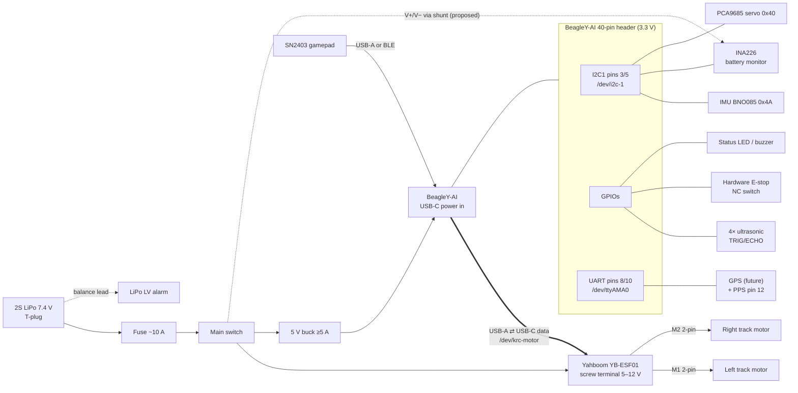
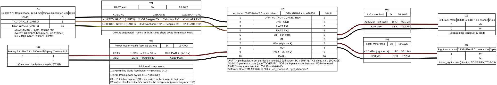
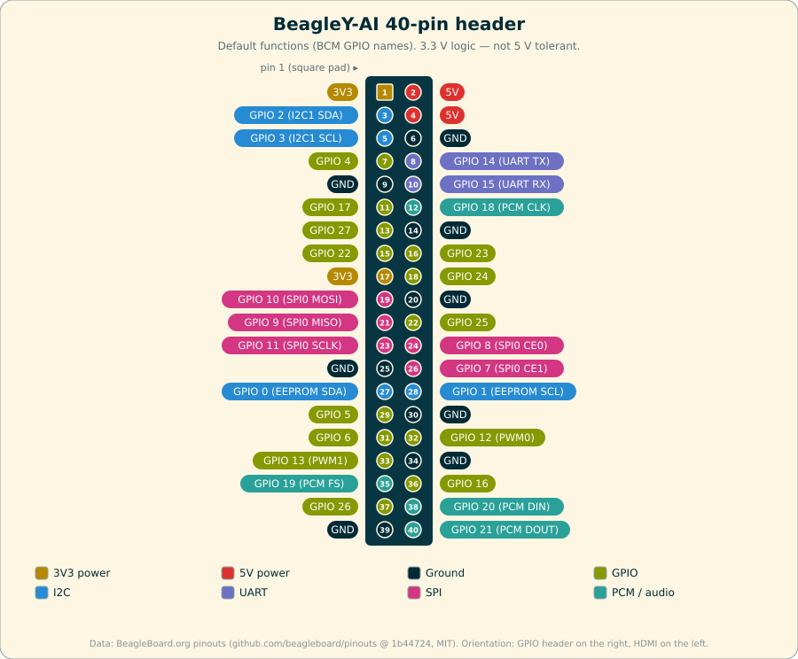
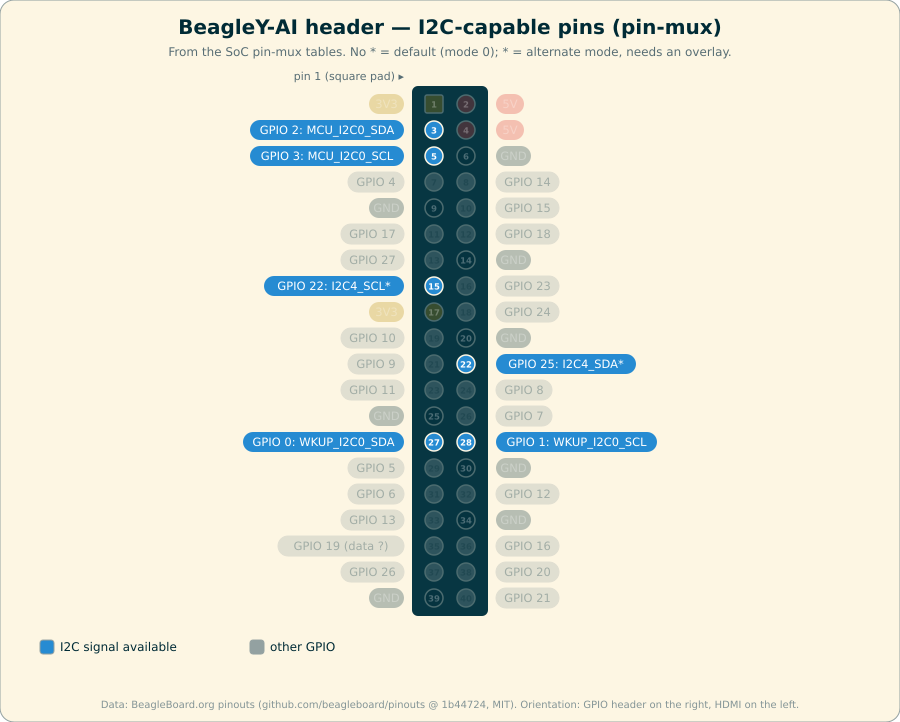
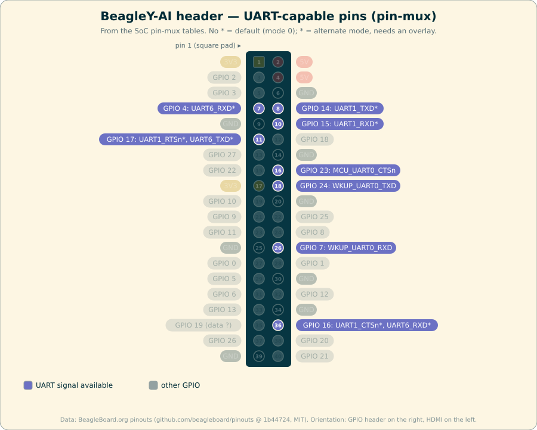
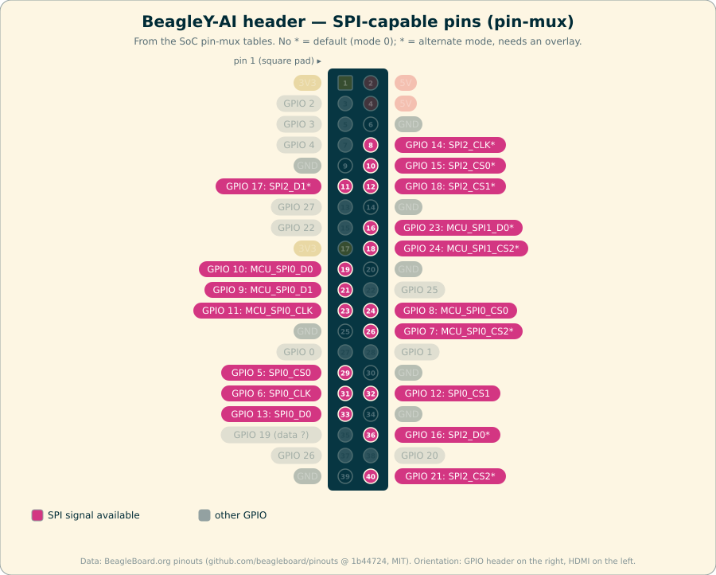
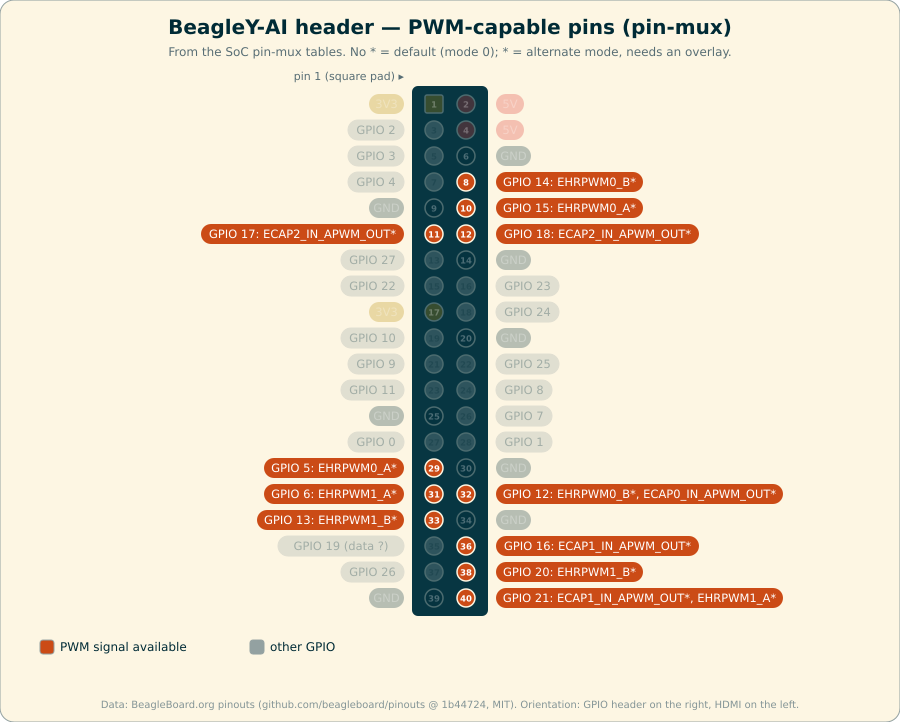

# KR-Robot wiring manual and interface control document (ICD)

| | |
|---|---|
| Scope | Electrical wiring from the BeagleY-AI 40-pin header and USB to the Yahboom motor board and the planned sensors. Also covers the matching software configuration and code mapping for each interface |
| Status | Rev A, 2026-10-02. The pin, bus and device facts were **measured on the robot's BeagleY-AI** (Debian 13, kernel `6.1.83-ti-arm64-r72`). Sensor parts and pin assignments are **proposals** until bench-verified |
| Related | [bringup.md](bringup.md) (procedures), [system-design.md](system-design.md) (software architecture), [../notes/kr-robot-motor-control-and-joystick.md](../notes/kr-robot-motor-control-and-joystick.md) (motor, power and joystick decisions), Design doc v3 (`Design/knowledge-agent-architecture.md`) |

**Status legend used throughout:**

- **VERIFIED**: measured on the board or proven in use.
- **SOURCE**: taken from the BeagleY-AI documentation or the pinout page.
- **PROPOSED**: a design decision that hasn't been built yet.
- **TO VERIFY**: needs a bench measurement before it is relied on.

---

## 1. Electrical rules (read first)

1. **The BeagleY-AI header is 3.3 V logic and is NOT 5 V tolerant.** Never connect a 5 V output (HC-SR04 echo, 5 V UART, 5 V I2C pull-ups) directly to a header GPIO. Use a divider or a level shifter (§5.5, §5.3).
2. **Never back-feed 5 V into the BeagleY-AI.** Header pins 2 and 4 are 5 V *outputs* for small loads. Do **not** connect the Yahboom board's "5V" header pin, or any other 5 V supply, to them. The BeagleY-AI is powered only from its own 5 V buck through USB-C (README §5).
3. **All grounds are common.** The battery negative, the Yahboom GND, the buck GND and the BeagleY-AI GND all meet at one point. USB already joins the BeagleY-AI and Yahboom grounds, but any header wiring to the Yahboom board still needs its own GND wire.
4. **Wire with the power off.** Power off the BeagleY-AI and isolate the battery at the main switch before changing anything on the header.
5. **Do not rely on internal pull resistors.** **VERIFIED 2026-10-02:** `gpioget --bias=pull-up` and `--bias=pull-down` are both *accepted* but have no effect (the pin reads the same either way). Every input that needs a defined idle level gets an **external** pull resistor.
6. **Keep header wiring short.** Aim for 30 cm or less for I2C at 400 kHz. Use twisted pairs (signal + GND) for long runs such as ultrasonic echo lines, and route them away from motor leads.
7. **No safety function depends on the header I2C bus or the ultrasonics.** The hardware E-stop (§5.6) is a direct GPIO input on the L5 path, and the motor link has its own watchdog. Obstacle stopping (L4 rules) is a convenience, not a safety function.

---

## 2. System wiring overview



---

### 2.1 Harness diagram: motor drive (as built)

This shows the BeagleY-AI header UART → Yahboom YB-ESF01 → track motors, and battery → Yahboom power. It is generated from [wiring/krc-motor-drive.yml](wiring/krc-motor-drive.yml) with WireViz. See [wiring/README.md](wiring/README.md) to edit it, and [wiring/krc-motor-drive.bom.tsv](wiring/krc-motor-drive.bom.tsv) for the BOM.



---

## 3. BeagleY-AI 40-pin header reference

The physical pin numbers and BCM-style names follow the Raspberry Pi convention. Pin 1 has the square pad.

| Column | Source |
|---|---|
| Ball | **SOURCE**, pinout.beagley.ai |
| Line | **VERIFIED** with `gpioinfo`. The line names (`GPIO22` …) are what the code uses, not offsets |
| Today | **VERIFIED** pinmux owner on the board as of 2026-10-02 |
| KR-Robot | **PROPOSED** allocation |

| Pin | Name | Ball | Linux line (chip:offset) | Today | **KR-Robot allocation** |
|---|---|---|---|---|---|
| 1 | 3V3 | — | — | power | Sensor VCC (IMU, INA226, PCA9685 logic, pull-ups, HC-SR04P) |
| 2 | 5V | — | — | power | HC-SR04 VCC (only if using 5 V modules). **Never an input** |
| 3 | GPIO2 / I2C1 SDA | E11 | chip0:18 | **I2C**: `mcu-i2c0` → `/dev/i2c-1` | **I2C1 SDA**, the sensor bus |
| 4 | 5V | — | — | power | spare 5 V |
| 5 | GPIO3 / I2C1 SCL | B13 | chip0:17 | **I2C**: `mcu-i2c0` → `/dev/i2c-1` | **I2C1 SCL**, the sensor bus |
| 6 | GND | — | — | ground | sensor GND |
| 7 | GPIO4 | W26 | chip1:38 | GPIO | **IMU INT** (BNO085 `H_INTN`), input |
| 8 | GPIO14 / UART TX | F24 | chip2:14 | GPIO (UART not muxed) | **UART TX** → GPS RX (future). The alternative motor UART is §5.1b |
| 9 | GND | — | — | ground | GND |
| 10 | GPIO15 / UART RX | C27 | chip2:13 | GPIO (UART not muxed) | **UART RX** ← GPS TX (future) |
| 11 | GPIO17 | A26 | chip2:8 | GPIO | **IMU RST** (BNO085 `RST`), output, active low |
| 12 | GPIO18 | D25 | chip2:11 | GPIO | **GPS PPS** (future, `pps-gpio18` overlay) |
| 13 | GPIO27 | N22 | chip1:33 | GPIO | **Hardware E-stop input**, NC to GND, external 10 kΩ pull-up |
| 14 | GND | — | — | ground | E-stop switch return |
| 15 | GPIO22 | R27 | chip1:41 | GPIO | **US1 front-left TRIG**, output |
| 16 | GPIO23 | B5 | chip0:7 | GPIO | **US1 front-left ECHO**, input |
| 17 | 3V3 | — | — | power | 3V3 for the pull-ups / ultrasonic modules |
| 18 | GPIO24 | C8 | chip0:10 | GPIO | **US2 front-centre TRIG**, output |
| 19 | GPIO10 / SPI0 MOSI | B12 | chip0:3 | **SPI**: `mcu-spi0-can` (MCP2515 overlay, chip absent) | **Reserved: SPI0 for the CAN link** (§5.11) |
| 20 | GND | — | — | ground | GND |
| 21 | GPIO9 / SPI0 MISO | C11 | chip0:4 | **SPI**: `mcu-spi0-can` | **Reserved: SPI0** |
| 22 | GPIO25 | P21 | chip1:42 | GPIO, the MCP2515 overlay's IRQ | **Reserved: CAN INT** |
| 23 | GPIO11 / SPI0 SCLK | A9 | chip0:2 | **SPI**: `mcu-spi0-can` | **Reserved: SPI0** |
| 24 | GPIO8 / SPI0 CE0 | C12 | chip0:0 | **SPI**: `mcu-spi0-can` | **Reserved: SPI0 CS0** |
| 25 | GND | — | — | ground | GND |
| 26 | GPIO7 / SPI0 CE1 | B3 | chip0:9 | GPIO | Reserved: SPI0 CS1 |
| 27 | GPIO0 / ID_SD | D11 | — (no line name) | HAT ID EEPROM I2C | **Do not use** (HAT EEPROM bus) |
| 28 | GPIO1 / ID_SC | B9 | — | HAT ID EEPROM I2C | **Do not use** |
| 29 | GPIO5 | B20 | chip2:15 | GPIO | **US2 front-centre ECHO**, input |
| 30 | GND | — | — | ground | GND |
| 31 | GPIO6 | D20 | chip2:17 | GPIO | **US3 front-right TRIG**, output |
| 32 | GPIO12 / PWM0 | C20 | chip2:16 | GPIO | Spare. PWM-capable (`pwm-epwm0-gpio12`, `pwm-ecap0-gpio12`) |
| 33 | GPIO13 / PWM1 | E19 | chip2:18 | GPIO | Spare. PWM-capable (`pwm-epwm1-gpio13`) |
| 34 | GND | — | — | ground | GND |
| 35 | GPIO19 | C26 | chip2:12 | GPIO | **Buzzer**, output (via transistor) |
| 36 | GPIO16 | A25 | chip2:7 | GPIO | **US3 front-right ECHO**, input |
| 37 | GPIO26 | P26 | chip1:36 | GPIO | **US4 rear TRIG**, output |
| 38 | GPIO20 | F23 | chip2:10 | GPIO | **US4 rear ECHO**, input |
| 39 | GND | — | — | ground | GND |
| 40 | GPIO21 | B25 | chip2:9 | GPIO | **Status LED**, output (330 Ω series resistor) |

**Measured on the board (VERIFIED):**

- `/dev/i2c-1` is `omap_i2c 4900000.i2c` (MCU_I2C0, the alias `i2c1`). It runs at **100 kHz** by default and has **no devices attached** today.
- `/dev/ttyAMA0` is a udev link to `ttyS3` (`2810000.serial`, main_uart1). Its pins are **not muxed** until the `uart-ttyama0` overlay is applied.
- The boot console is `ttyS2` (main_uart0), on the separate **3-pin JST-SH debug UART**, not the 40-pin header.
- The gpiochips are `gpiochip0` (`4201000.gpio`, MCU domain), `gpiochip1` (`600000.gpio`) and `gpiochip2` (`601000.gpio`).

---

### 3.1 Pinout diagrams

These diagrams are generated by [../tools/gen_pinout_diagrams.py](../tools/gen_pinout_diagrams.py) from BeagleBoard.org's pinout data ([beagleboard.github.io/pinouts](https://beagleboard.github.io/pinouts/), MIT licence, see [images/NOTICE.md](images/NOTICE.md)). They use the same layout and colours as that site.

- The bus views are built from the SoC pin-mux tables (Appendix A), not from the site's summary fields. Those fields contain errors at the pinned commit.
- Every pin's GPIO line is **validated against the board** (`gpioinfo`). See the note under Appendix A.

| Default functions | KR-Robot allocation (§3 table) |
|---|---|
|  |  |

| I2C | UART | SPI | PWM |
|---|---|---|---|
|  |  |  |  |

In the bus views, **no \*** means the function is the pin's default (mode 0). **\*** means an alternate mode, which needs a device-tree overlay (§4).

---

## 4. Board configuration (device-tree overlays)

The header functions are selected with overlays listed on the `fdtoverlays` line of `/boot/firmware/extlinux/extlinux.conf`. Overlays are space-separated, and changes take effect after a reboot.

**VERIFIED current state (2026-10-02):** the line is `fdtoverlays /overlays/mcp2515-can0.dtbo`. That overlay was left on the board from earlier work, and it has two problems:

- **No MCP2515 chip is fitted.** The boot log shows `mcp251x spi1.0: Probe failed, err=110`, and `can0` does not exist.
- **It still claims header pins 19/21/23/24** (MCU_SPI0, 2 MHz, 12 MHz crystal), and sets pin 22 (`GPIO25`) as its IRQ.

**Recommended `fdtoverlays` line for KR-Robot (PROPOSED):**

```text
fdtoverlays /overlays/k3-am67a-beagley-ai-i2c1-400000.dtbo
```

| Overlay | Add it when | Effect |
|---|---|---|
| `k3-am67a-beagley-ai-i2c1-400000.dtbo` | The IMU is fitted | `/dev/i2c-1` at 400 kHz. The BNO085 and INA226 both support 400 kHz |
| `k3-am67a-beagley-ai-uart-ttyama0.dtbo` | GPS, or the alternative motor UART | Muxes pins 8/10 to `/dev/ttyAMA0` |
| `k3-am67a-beagley-ai-pps-gpio18.dtbo` | GPS PPS | Turns pin 12 into `/dev/pps0` |
| `mcp2515-can0.dtbo` | **Only** if an MCP2515 CAN HAT is actually fitted (§5.11) | Gives `can0` on SPI0 with its IRQ on pin 22 |
| `k3-am67a-beagley-ai-pwm-*` | You want hardware PWM on pins 32/33 (or others) | Hardware PWM through `/sys/class/pwm` |

Apply and verify (needs sudo, then a reboot):

```bash
sudo cp /boot/firmware/extlinux/extlinux.conf /boot/firmware/extlinux/extlinux.conf.bak
sudo sed -i 's#^\(\s*\)fdtoverlays .*#\1fdtoverlays /overlays/k3-am67a-beagley-ai-i2c1-400000.dtbo#' /boot/firmware/extlinux/extlinux.conf
sudo reboot
# after boot:
sudo dmesg | grep "4900000.i2c"          # expect: bus 1 ... at 400 kHz
/usr/sbin/i2cdetect -y -r 1              # expect the fitted sensors' addresses (§5.3)
```

---

## 5. Interfaces

Each interface below lists:

- its status and the part used
- the wiring, from → to
- the Linux device and protocol
- the software configuration (the proposed `krbot.conf` keys)
- the code mapping across the five layers
- a bring-up test

### 5.1 IF-01 Motor board link: USB serial (design primary)

> **As built (2026-10-02): the robot uses the header UART, §5.1b, instead of USB.** Both are **VERIFIED** working on the robot:
>
> - `uart-ttyama0` overlay → `/dev/ttyAMA0`
> - `$upload`/`$MAll` reports
> - `$pwm` driving M1 (left) and M2 (right) under gamepad teleop
>
> The software defaults now point to `/dev/ttyAMA0`, with USB `/dev/krc-motor` as the fallback. The harness is drawn in §2.1. Still open: **TC-A-05** (TX2 ≤ 3.3 V) and **TC-F-05/06** (track direction), in [test-validation.md](test-validation.md).

| | |
|---|---|
| Status | Design primary (README §3.1). USB is now the **fallback**. The as-built link is §5.1b |
| Part | Yahboom 4-Channel Encoder Motor Drive Module **YB-ESF01-V2.0**: STM32F103RCT6, AT8236 ×4, CH340K |

**Data wiring:** a USB-C **data** cable from the Yahboom board's USB-C port to any **USB-A** port on the BeagleY-AI. The 40-pin header is **not** used for the motor link.

**Power and motor wiring (Yahboom side):**

| From | To | Notes |
|---|---|---|
| Battery + (via the ~10 A fuse and main switch) | Yahboom screw terminal **+** | 2S: 6.0–8.4 V, inside the 5–12 V input range. See README §5 before moving to 3S |
| Battery − | Yahboom screw terminal **−** | This is the common ground star point |
| Left track motor (33GB-520) | **M1** 2-pin (M1+, M1−) | Use the 2-pin port, **not** the 6-pin encoder header (that one is for Yahboom encoder motors only) |
| Right track motor | **M2** 2-pin (M2+, M2−) | Separate the motors' joined XT30 leads first |
| Yahboom "5V" header pin | **nothing** | Never connect it to the BeagleY-AI |

| Linux / protocol | |
|---|---|
| Device | `/dev/krc-motor` (udev symlink for CH340 `1a86:7522/7523`), falling back to `/dev/ttyUSB0` |
| Protocol | ASCII `$cmd:args#` at 115200 8N1 (README §3.2). `flock`-exclusive. DTR/RTS are held low |
| Rate | 50 Hz (`$pwm:` frames from `ManualDrive`) |

| Code mapping | |
|---|---|
| Config | `[motor] driver, port, fallback_port, mode, profile, pwm_keyword, speed_keyword, max_output` (they already exist) |
| L1 | `driver::YahboomMotorControllerDriver : IMotorController` (exists) |
| L2 | `percep::MotorHealthSource` → `motorBoard linkHealthy` (exists). Encoder telemetry → `speedMmS` after the encoder upgrade |
| L5 | `ManualDrive` → `setAllChannels()` at 50 Hz (exists). On a fault it holds ESTOP every tick |
| Test | `krc-diag.sh`, then `yahboom_probe.py listen`, then [bringup.md](bringup.md) step 4 |

#### 5.1b Alternative: header UART to Yahboom UART2 (NOT recommended)

Use this only if USB proves unreliable. **I2C and serial cannot both be active on the Yahboom board**, and whether its USB-C (CH340) and UART2 can coexist is **TO VERIFY**.

| BeagleY-AI | Yahboom 4-pin UART header | Notes |
|---|---|---|
| Pin 8 (TXD, `/dev/ttyAMA0`) | RX2 | Apply the `uart-ttyama0` overlay |
| Pin 10 (RXD) | TX2 | **TO VERIFY first:** with the Yahboom board powered and **disconnected**, measure TX2's idle voltage. Connect it only if it is ≤ 3.3 V. Otherwise use a level shifter |
| Pin 6 (GND) | GND | Required |
| — | 5V | **Leave unconnected** |

Code change: `motor.port=/dev/ttyAMA0`. No other change is needed (same protocol). This alternative conflicts with GPS on pins 8/10.

### 5.2 IF-02 Gamepad (SN2403)

| | |
|---|---|
| Status | Wired **VERIFIED** (`045e:028e` through `xpad`, with rumble). BLE adapter **VERIFIED**; pad pairing **TO VERIFY** |
| Wiring | A USB **data** cable into a **USB-A** port (the BeagleY-AI's USB-C is power-only). Or BLE through `scripts/bt-pair-gamepad.sh` |
| Linux | `/dev/input/eventN`, auto-detected (`input.device=` to pin it) |
| Code | L5 `exec::InputDriver` (exists), on its own discovery thread |

### 5.3 IF-03 I2C sensor bus (shared)

| | |
|---|---|
| Status | Bus **VERIFIED** (empty, 100 kHz). Devices **PROPOSED** |
| Pins | **3 (SDA), 5 (SCL)**, 1 (3V3), 6 (GND) → `/dev/i2c-1` |
| Speed | 100 kHz today; 400 kHz with the `i2c1-400000` overlay (§4) |
| Pull-ups | **3.3 V only.** Most breakout boards carry 10 kΩ (Adafruit/SparkFun) or 4.7 kΩ pull-ups. With 3 or 4 boards in parallel the effective value falls to about 2.5–3.3 kΩ, which is fine. **Remove the pull-ups from any board that pulls up to 5 V.** Whether the BeagleY-AI has on-board pull-ups on pins 3/5 is **TO VERIFY** with a meter (SDA and SCL to 3V3, power off) |
| Topology | A daisy-chain with short stubs, or a Qwiic/STEMMA-QT (JST-SH 4-pin, 3.3 V) chain. Keep the total length ≤ 30 cm at 400 kHz |

**I2C address map (PROPOSED):**

| Address | Device | Interface | Notes |
|---|---|---|---|
| `0x40` | PCA9685 16-ch PWM (servos) | IF-08 | Existing `servo/pca9685_servo.cpp`. It also answers the **all-call address `0x70`**, so keep `0x70` free |
| `0x44` | SHT40 temperature/humidity (future) | — | The same part as the VIU design |
| `0x45` | INA226 battery monitor | IF-07 | Strap **A1=VS, A0=VS** (TI address table). The default A1=A0=GND gives `0x40`, which clashes with the PCA9685, and A1=VS, A0=GND gives `0x44`, which clashes with the SHT40. **TO VERIFY** the straps on the chosen breakout |
| `0x48` | TMP117 temperature (future) | — | The same part as the VIU design |
| `0x4A` | **BNO085 IMU** | IF-04 | `0x4B` if its address strap is set |
| `0x70` | *(reserved: PCA9685 all-call)* | — | — |

Test: `/usr/sbin/i2cdetect -y -r 1` must show exactly the fitted addresses. `beagle` is in the `i2c` and `gpio` groups, so no sudo is needed.

### 5.4 IF-04 IMU: BNO085 (PROPOSED)

| | |
|---|---|
| Status | **PROPOSED** part. Nothing is fitted |
| Why BNO085 | It does 9-DoF fusion on-chip (game-rotation-vector and rotation-vector quaternions), so L2 doesn't need its own AHRS. It runs at 3.3 V, and Adafruit 4754 / SparkFun breakouts with Qwiic exist |
| Alternatives | **ICM-20948** (`0x68`/`0x69`, raw 9-DoF, so L2 runs a Madgwick/complementary filter). **MPU-6050** (`0x68`, 6-DoF only, cheapest). The config key `imu.driver` selects one |
| Caveat | The BNO08x uses I2C clock stretching. The AM67A `omap_i2c` controller supports stretching, but this is **TO VERIFY** under load. The fallback is the BNO085's **UART-RVC** mode (heading/pitch/roll at 100 Hz, no host protocol) on `/dev/ttyAMA0`, which conflicts with GPS |

**Wiring:**

| BNO085 breakout | BeagleY-AI pin | Notes |
|---|---|---|
| VIN / 3Vo | 1 (3V3) | Use 3.3 V even if the breakout has a regulator |
| GND | 6 (GND) | |
| SDA | 3 | |
| SCL | 5 | |
| INT (`H_INTN`) | 7 (`GPIO4`) | Active low, "data ready". The breakout pulls it up to 3.3 V |
| RST | 11 (`GPIO17`) | Active low. The host drives it high in normal use |
| PS0 / PS1 | GND / GND | Selects I2C mode (the default on most breakouts) |
| Mounting | — | Rigid, near the chassis centre and away from motor magnets. Record the axis orientation in config (`imu.mount`) |

**Code mapping (PROPOSED):**

| Layer | Item |
|---|---|
| Config | `[imu] driver=bno085  bus=/dev/i2c-1  address=0x4A  int_line=GPIO4  reset_line=GPIO17  rate_hz=100  mount=x_forward_z_up` |
| L1 | New interface `driver::IImu { std::optional<ImuSample> read(); bool isHealthy() const; }`, where `ImuSample{quat w,x,y,z; gyro[3] rad/s; accel[3] m/s²; t}`. New class `Bno085ImuDriver : IImu`, which uses the existing `I2CDevice` and the SH-2/SHTP protocol (a vendored, BSD-licensed `sh2` C library, wrapped). It waits on the INT line with libgpiod v2 edge events, not polling |
| L2 | `ImuSource : ISensorSource` emits `Observation{Orientation}` (yaw/pitch/roll in degrees) and `Observation{AngularRate}`. `ObservationMapper` turns these into `robot heading <deg>`, `robot pitch <deg>` and `robot roll <deg>` (TTL 200 ms, Perception) |
| L4 | Future rules: tilt over threshold, then `HoldPosition` (safety band, salience ≥ 100) |
| Monitor | Add `imu{healthy, yaw, pitch, roll}` to the status snapshot, and an IMU card |
| Test | `i2cdetect` shows `0x4A`. A unit test for the SHTP framing. A bench test rotating the robot 90° should read 90 ± 2° of yaw |

### 5.5 IF-05 Ultrasonic rangers ×4 (PROPOSED)

| | |
|---|---|
| Status | **PROPOSED**. Doc v3 §11 leaves the transport open (GPIO-timed vs I2C-native). This ICD **chooses GPIO-timed**, which is cheap and gives independent sensors |
| Part | **HC-SR04P** or **RCWL-1601**, the 3.3 V-capable variants. Powered from 3V3, their echo is a safe 3.3 V. If you use classic 5 V **HC-SR04** modules instead, power them from pin 2 (5V) and fit a **divider on every ECHO line**: 1 kΩ in series from ECHO, 2 kΩ to GND, tapping between them. That gives 5 V × 2/3 = 3.3 V |
| Range / timing | 2–400 cm. ECHO high time = distance × 58 µs/cm, so 400 cm ≈ 23 ms. Fire **sequentially** (one sensor at a time, 30 ms slot) to avoid crosstalk. That gives each sensor **≈ 8 Hz** with 4 sensors |

**Wiring (each module: VCC, TRIG, ECHO, GND):**

| Sensor | Frame position | TRIG (output) | ECHO (input) | VCC | GND |
|---|---|---|---|---|---|
| US1 | front-left, angled 30° outward | pin **15** `GPIO22` | pin **16** `GPIO23` | pin 17 (3V3)\* | pin 14 |
| US2 | front-centre | pin **18** `GPIO24` | pin **29** `GPIO5` | pin 17\* | pin 20 |
| US3 | front-right, angled 30° outward | pin **31** `GPIO6` | pin **36** `GPIO16` | pin 1\* | pin 30 |
| US4 | rear-centre | pin **37** `GPIO26` | pin **38** `GPIO20` | pin 1\* | pin 39 |

\* Use 3V3 for HC-SR04P/RCWL-1601. Use pin 2/4 (5V) **plus the echo divider** for classic HC-SR04.

Practical wiring: a small distribution board, or a Wago block for 3V3/GND to all four modules, keeps the header from being over-crowded. Use twisted pairs (ECHO with GND) for runs over 20 cm.

**Code mapping (PROPOSED):**

| Layer | Item |
|---|---|
| Config | `[ultrasonic] sensors=us1,us2,us3,us4  slot_ms=30  max_range_m=4.0  min_range_m=0.03` and, per sensor, `[ultrasonic.us1] trig=GPIO22  echo=GPIO23  frame=front_left  yaw_deg=30` |
| L1 | `driver::UltrasonicSensorDriver : IDistanceSensor` (the interface already exists, deviation D5). It uses **libgpiod v2** (`gpiod.hpp`, already installed: `libgpiod-dev 2.2.1`). Lines are requested **by name** (`chip.get_line_offset_from_name("GPIO22")`), and both edges on ECHO are requested with kernel timestamps. Pulse width = falling − rising timestamp, then d = width × 343 m/s ÷ 2. A 10 µs TRIG pulse starts each reading, and a timeout of 25 ms returns `std::nullopt`. `DriverRegistry` creates one driver per sensor, and a single **scheduler thread** fires them in turn so they never overlap |
| L2 | `UltrasonicSource : ISensorSource` applies a median-of-3 per sensor (doc v3 §3: "ultrasonic debounce/median") and emits `Observation{Distance, "us1", metres}`. Out-of-range readings are dropped, not reported as 0 |
| L3 | `us1 distanceTo 0.42` (TTL 500 ms, multi-valued `add`), matching the doc v3 §5.4 example rule pattern |
| L4 | `obstacle-close-stop` (salience 100): `distanceTo < 0.30`, then `post-goal HoldPosition`. This is Phase 1 |
| Monitor | Add `ultrasonic{us1..us4: metres or null}` to the snapshot, and a range "radar" card |
| Test | Unit test: the pulse-width → distance maths. Bench: a flat target at 0.50 m should read 0.50 ± 0.02 m. Firing all four must not cross-trigger (check each with the others covered) |

### 5.6 IF-06 Hardware E-stop input (PROPOSED)

| | |
|---|---|
| Status | **PROPOSED**. It matches the VIU design's E-stop philosophy (NC contact, pulled up, so a broken wire means STOP) |
| Part | A latching mushroom E-stop with an **NC** contact block |

**Wiring:**

| From | To | Notes |
|---|---|---|
| Pin 1 (3V3) → **10 kΩ** → pin 13 (`GPIO27`) | — | An **external** pull-up is required (rule 5) |
| Pin 13 (`GPIO27`) | E-stop NC contact, terminal 1 | Normal state: contact closed, so the pin reads **0** |
| E-stop NC contact, terminal 2 | Pin 14 (GND) | Pressed, or wire broken: the pin reads **1**, meaning **STOP** |
| Optional: 100 nF from pin 13 to GND | — | Debounce and noise. The software also debounces (5 ms) |

This input stops the **robot's software** (latched ESTOP plus zero PWM). It does **not** cut motor power. A power-cutting E-stop belongs in the battery → Yahboom line (a contactor, or the main switch), and remains **TO DESIGN** with the power wiring.

**Code mapping (PROPOSED):**

| Layer | Item |
|---|---|
| Config | `[estop] line=GPIO27  active=high  debounce_ms=5` (active = the level that means STOP) |
| L1 | New `driver::GpioInput` (a libgpiod v2 edge-event wrapper) |
| L5 | `HardwareEstop` runs on its own thread, or inside the watchdog thread. On the STOP edge, or a STOP level at start-up, it calls `ManualDrive::requestEstop("hardware e-stop")`. While the input reads STOP, ESTOP is **held every tick**, like a motor fault, so START cannot re-arm it. This is the direct L5 path (doc v3 §6) and does not go through L2/L3/L4 |
| L3 | `estopButton pressed true/false` (an Operator fact, for reasoning and logs only) |
| Monitor | An E-stop button state card |
| Test | Unit test: ManualDrive holds ESTOP while the input reads STOP. Bench: press, then the monitor shows ESTOP; release and press START, then it re-arms; unplug the switch, then ESTOP |

### 5.7 IF-07 Battery monitor: INA226 (PROPOSED)

| | |
|---|---|
| Status | **PROPOSED**. This closes the "no low-voltage cutoff on the board" gap (README §5). It is the same part as the BMS design |
| Wiring | IN+ / IN− across a **shunt in the battery + line** after the fuse (a 2 mΩ shunt gives 40 mV at 20 A). VBUS to the battery + side. VS to 3V3. SDA/SCL/GND to pins 3/5/6. Address **0x45** (§5.3) |
| Config | `[battery] driver=ina226  address=0x45  shunt_ohm=0.002  max_current_a=20  warn_v=7.0  stop_v=6.6` |
| L1 / L2 / L3 | `Ina226Monitor : IBatteryMonitor` → `Observation{Battery}` → `battery batteryVolts 7.62` (the mapper already exists) and `battery currentA` |
| L4 / L5 | Rule: below 7.0 V → warn. Below 6.6 V (3.3 V/cell) → `HoldPosition`, then e-stop. The monitor shows volts, amps and a % estimate |
| Test | Compare against a multimeter: within ±0.05 V and ±2 % current |

### 5.8 IF-08 Servo / PWM: PCA9685 (existing hardware)

| | |
|---|---|
| Status | Code exists ([../servo/](../servo/)). The wiring is **PROPOSED** for KR-Robot (for example a pan/tilt mount) |
| Wiring | VCC (logic) → pin 1 (3V3). GND → pin 6. SDA/SCL → pins 3/5. **V+ (servo power) comes from a separate 5–6 V BEC/buck rated for the servos, never from the BeagleY-AI.** Its ground joins the common ground |
| Config | `[servo] address=0x40  freq_hz=50` |
| Code | Port `servo/pca9685_servo.cpp` into `driver::Pca9685 : IServoController` (L1), and drive it from BT actions in Phase 3 |

### 5.9 IF-09 GPS (future)

| | |
|---|---|
| Status | **FUTURE**. It matches the VIU GPS choice (u-blox NEO-M8N / M9N) for continuity |
| Wiring | Module VCC → 3V3 (check the module draw), GND → pin 9, module **TXD → pin 10**, module **RXD ← pin 8**, **PPS → pin 12** |
| Overlays | `uart-ttyama0` (→ `/dev/ttyAMA0`), `pps-gpio18` (→ `/dev/pps0`) |
| Code | `driver::NmeaGps` (9600 baud NMEA, later UBX) → `robot position lat/lon`, with gpsd as an alternative |

### 5.10 IF-10 Indicators (PROPOSED)

| Function | Pin | Wiring | Code |
|---|---|---|---|
| Status LED | 40 (`GPIO21`) | Pin → 330 Ω → LED anode, cathode → GND (~4 mA) | `[indicators] led=GPIO21`. Off = not running, slow blink = DISARMED, solid = ARMED, fast blink = ESTOP |
| Buzzer | 35 (`GPIO19`) | Pin → 1 kΩ → NPN base (e.g. 2N2222). Buzzer + to 5V, − to the collector, emitter to GND | `[indicators] buzzer=GPIO19`. Chirp on arm, continuous on ESTOP |

### 5.11 IF-11 CAN link to the VIU (reserved)

| | |
|---|---|
| Status | **RESERVED**. The future VIU and BMS boards talk isolated CAN-FD. An MCP2515 (classic CAN) HAT on SPI0 is the stop-gap, and an MCP2518FD would be needed for CAN-FD |
| Pins | 19, 21, 23, 24 (SPI0) and **22** (`GPIO25`, IRQ). These match the existing `mcp2515-can0.dtbo` (12 MHz crystal, 2 MHz SPI) |
| Today | The overlay is loaded but **no chip is fitted** (`err=110`). Remove it until the HAT is fitted (§4) |

---

## 6. Pin allocation summary

| Use | Pins |
|---|---|
| Power 3V3 / 5V / GND | 1, 17 / 2, 4 / 6, 9, 14, 20, 25, 30, 34, 39 |
| I2C1 sensor bus | 3, 5 |
| IMU INT / RST | 7, 11 |
| Ultrasonic TRIG / ECHO | 15/16, 18/29, 31/36, 37/38 |
| Hardware E-stop | 13 |
| Status LED / buzzer | 40 / 35 |
| GPS UART / PPS (future) | 8, 10 / 12 |
| Reserved: SPI0 + CAN IRQ | 19, 21, 22, 23, 24, 26 |
| Do not use (HAT ID EEPROM) | 27, 28 |
| **Free** (PWM-capable) | **32, 33** |

There are no conflicts in this plan. The only shared resource is UART pins 8/10, which are claimed by **either** GPS **or** the alternative motor UART (§5.1b).

---

## 7. Software mapping summary (ICD for code)

### 7.1 Proposed `krbot.conf` additions

```ini
[imu]
driver = bno085              # bno085 | icm20948 | mpu6050 | none
bus = /dev/i2c-1
address = 0x4A
int_line = GPIO4
reset_line = GPIO17
rate_hz = 100
mount = x_forward_z_up

[ultrasonic]
sensors = us1,us2,us3,us4
slot_ms = 30
max_range_m = 4.0
[ultrasonic.us1]
trig = GPIO22
echo = GPIO23
frame = front_left
yaw_deg = 30
# us2: GPIO24/GPIO5 front_centre 0 | us3: GPIO6/GPIO16 front_right -30 | us4: GPIO26/GPIO20 rear 180

[estop]
line = GPIO27
active = high                # level meaning STOP (NC switch + pull-up)
debounce_ms = 5

[battery]
driver = ina226
address = 0x45
shunt_ohm = 0.002
warn_v = 7.0
stop_v = 6.6

[indicators]
led = GPIO21
buzzer = GPIO19
```

The `Config` parser treats `[ultrasonic.us1]` as the prefix `ultrasonic.us1.*`, which already works with the existing INI reader.

### 7.2 Code additions by layer

| Layer | New item | Depends on |
|---|---|---|
| L1 `driver/` | `GpioLine` / `GpioInput` / `GpioOutput` (libgpiod v2, by line name), `IImu` + `Bno085ImuDriver`, `UltrasonicSensorDriver` (+ the firing scheduler), `IBatteryMonitor` + `Ina226Monitor`, `IServoController` + `Pca9685` | `I2CDevice` (exists), `gpiodcxx` |
| L1 `DriverRegistry` | Build each driver from its config section. A missing or failed device → an **unhealthy placeholder**, the same pattern as the motor board (D7), so the robot still runs and reports it | — |
| L2 `percep/` | `ImuSource`, `UltrasonicSource` (median-of-3), `BatterySource`. New `Observation::Kind`: `Orientation`, `AngularRate` | `ObservationMapper` (extend) |
| L3 | No code change. New predicates: `heading`, `pitch`, `roll`, `distanceTo` (exists), `batteryVolts` (exists), `currentA`, `estopButton pressed` | — |
| L4 | Phase 1 rules: obstacle stop (ultrasonic), tilt stop (IMU), low battery | CLIPS |
| L5 | `HardwareEstop` (latched, held while pressed), `Indicators` (LED/buzzer pattern from the teleop mode) | `ManualDrive::requestEstop` (exists) |
| core | Monitor snapshot: `imu{}`, `ultrasonic{}`, `battery{}`, `estop_button` | `MonitorServer` (exists) |
| CMake | `pkg_check_modules(GPIOD REQUIRED libgpiodcxx)` → link to `krbot_driver` | `libgpiod-dev` (installed) |

### 7.3 Fact / observation ICD

| Predicate | Subject | Object (type, unit) | Source | Functional? | TTL |
|---|---|---|---|---|---|
| `linkHealthy` | `motorBoard`, `gamepad`, `imu`, `us1`… | `true` / `false` (symbol) | Perception | yes | 2 s |
| `distanceTo` | `us1`…`us4` | metres (float) | Perception | no (multi) | 500 ms |
| `heading` / `pitch` / `roll` | `robot` | degrees (float) | Perception | yes | 200 ms |
| `batteryVolts` / `currentA` | `battery` | V / A (float) | Telemetry | yes | 5 s |
| `pressed` | `estopButton` | `true` / `false` | Operator | yes | — |
| `teleopMode` | `robot` | `DISARMED` / `ARMED` / `ESTOP` | Operator | yes | — (exists) |

---

## 8. Bring-up checklist (per interface)

1. **Before wiring:** apply the §4 overlay changes and reboot. Check that `i2cdetect -y -r 1` shows an empty bus at the expected speed.
2. **I2C devices, one at a time** (power off for each change). After each one, `i2cdetect` must show exactly the expected address. Then run its unit/bench test (§5.3–5.8).
3. **E-stop:** run `gpioget GPIO27`. It must read **0** with the switch released and **1** when pressed or when the plug is removed.
4. **Ultrasonic, one sensor at a time:**
   - **Before connecting it**, measure the ECHO line with a meter: ≤ 3.3 V idle and pulsed. Do this *especially* for 5 V modules with the divider.
   - Then run `gpioset GPIO22=1` / `=0` for TRIG, and capture ECHO edges with `gpiomon --edges=both GPIO23` while waving a hand in front.
5. **Indicators:** `gpioset GPIO21=1` lights the LED.
6. **Record the results** in [bringup.md](bringup.md) §5, and move each interface's status here from PROPOSED / TO VERIFY to VERIFIED.

Every command above runs as `beagle` without sudo (groups `gpio`, `i2c`, `dialout`). Stop `krbot` first if it has claimed the lines. In libgpiod v2, `gpioset` **holds the line until it is stopped** (Ctrl-C). `gpioset -t 0 GPIO21=1` sets the line and exits instead.

---

## 9. Open items

- [ ] **Decide** whether to keep `mcp2515-can0.dtbo`. It is loaded but no chip is fitted, and it holds pins 19/21/23/24 (§4)
- [ ] **Confirm the parts:** the IMU (BNO085 recommended) and the ultrasonic modules (3.3 V HC-SR04P / RCWL-1601 recommended). If 5 V HC-SR04 modules are used, the echo dividers are mandatory
- [ ] TO VERIFY: whether the BeagleY-AI has on-board I2C pull-ups on pins 3/5 (meter, power off)
- [ ] TO VERIFY: BNO085 clock stretching on `omap_i2c` at 400 kHz, under load
- [ ] TO VERIFY: the INA226 breakout's address straps for `0x45`
- [ ] TO VERIFY (only for §5.1b): the Yahboom TX2 idle voltage, and whether USB and UART2 can coexist
- [ ] TO DESIGN: a power-cutting E-stop or contactor in the battery → Yahboom line
- [ ] Implement §7 (libgpiod v2 `GpioLine`, `UltrasonicSensorDriver`, `Bno085ImuDriver`, `HardwareEstop`, `Ina226Monitor`), with unit tests and monitor cards
- [ ] Fold the IMU, ultrasonic and E-stop decisions back into Design doc v3 §2/§11

## Appendix A. Header pin-mux alternate functions

Generated by `tools/gen_pinout_diagrams.py`. The upstream data is pinned at commit `1b44724` of `beagleboard/pinouts`. The "GPIO signal (board)" column is **measured on the robot** (`gpioinfo`: gpiochip0 = MCU_GPIO0, gpiochip1 = GPIO0, gpiochip2 = GPIO1).

**Upstream data errors found by validation:**

- **Pin 8:** its GPIO name is a typo (`GPIO0_14`, should be `GPIO1_14`).
- **Pin 35:** its whole table is a copy of pin 33's. Use pin 35 as a plain GPIO only.

| Pin | BCM | SoC ball | GPIO signal (board) | Pin-mux modes (upstream) |
|---|---|---|---|---|
| 3 | GPIO2 | E11 | MCU_GPIO0_18 | Alt0: MCU_I2C0_SDA<br/>Alt7: MCU_GPIO0_18 |
| 5 | GPIO3 | B13 | MCU_GPIO0_17 | Alt0: MCU_I2C0_SCL<br/>Alt7: MCU_GPIO0_17 |
| 7 | GPIO4 | W26 | GPIO0_38 | Alt0: GPMC0_WAIT1<br/>Alt1: VOUT0_EXTPCLKIN<br/>Alt2: GPMC0_A21<br/>Alt3: UART6_RXD<br/>Alt4: AUDIO_EXT_REFCLK2<br/>Alt7: GPIO0_38<br/>Alt8: EQEP2_I |
| 8 | GPIO14 | F24 | GPIO1_14 | Alt0: MCASP0_ACLKR<br/>Alt1: SPI2_CLK<br/>Alt2: UART1_TXD<br/>Alt6: EHRPWM0_B<br/>Alt7: GPIO0_14<br/>Alt8: EQEP1_I<br/>(upstream Alt7 reads GPIO0_14; corrected to GPIO1_14 from the board) |
| 10 | GPIO15 | C27 | GPIO1_13 | Alt0: MCASP0_AFSR<br/>Alt1: SPI2_CS0<br/>Alt2: UART1_RXD<br/>Alt6: EHRPWM0_A<br/>Alt7: GPIO1_13<br/>Alt8: EQEP1_S |
| 11 | GPIO17 | A26 | GPIO1_8 | Alt0: MCASP0_AXR2<br/>Alt1: SPI2_D1<br/>Alt2: UART1_RTSn<br/>Alt3: UART6_TXD<br/>Alt5: ECAP2_IN_APWM_OUT<br/>Alt7: GPIO1_8<br/>Alt8: EQEP0_B |
| 12 | GPIO18 | D25 | GPIO1_11 | Alt0: MCASP0_ACLKX<br/>Alt1: SPI2_CS1<br/>Alt2: ECAP2_IN_APWM_OUT<br/>Alt7: GPIO1_11<br/>Alt8: EQEP1_A |
| 13 | GPIO27 | N22 | GPIO0_33 | Alt0: GPMC0_OEn_REn<br/>Alt2: MCASP1_AXR1<br/>Alt6: TRC_DATA8<br/>Alt7: GPIO0_33 |
| 15 | GPIO22 | R27 | GPIO0_41 | Alt0: GPMC0_CSn0<br/>Alt1: I2C4_SCL<br/>Alt3: MCASP2_AXR14<br/>Alt6: TRC_DATA15<br/>Alt7: GPIO0_41 |
| 16 | GPIO23 | B5 | MCU_GPIO0_7 | Alt0: MCU_UART0_CTSn<br/>Alt1: MCU_TIMER_IO0<br/>Alt3: MCU_SPI1_D0<br/>Alt7: MCU_GPIO0_7 |
| 18 | GPIO24 | C8 | MCU_GPIO0_10 | Alt0: WKUP_UART0_TXD<br/>Alt2: MCU_SPI1_CS2<br/>Alt7: MCU_GPIO0_10 |
| 19 | GPIO10 | B12 | MCU_GPIO0_3 | Alt0: MCU_SPI0_D0<br/>Alt7: MCU_GPIO0_3 |
| 21 | GPIO9 | C11 | MCU_GPIO0_4 | Alt0: MCU_SPI0_D1<br/>Alt7: MCU_GPIO0_4 |
| 22 | GPIO25 | P21 | GPIO0_42 | Alt0: GPMC0_CSn1<br/>Alt1: I2C4_SDA<br/>Alt3: MCASP2_AXR15<br/>Alt6: TRC_DATA16<br/>Alt7: GPIO0_42 |
| 23 | GPIO11 | A9 | MCU_GPIO0_2 | Alt0: MCU_SPI0_CLK<br/>Alt7: MCU_GPIO0_2 |
| 24 | GPIO8 | C12 | MCU_GPIO0_0 | Alt0: MCU_SPI0_CS0<br/>Alt4: WKUP_TIMER_IO1<br/>Alt7: MCU_GPIO0_0 |
| 26 | GPIO7 | B3 | MCU_GPIO0_9 | Alt0: WKUP_UART0_RXD<br/>Alt2: MCU_SPI0_CS2<br/>Alt7: MCU_GPIO0_9 |
| 27 | GPIO0 | D11 | — (HAT EEPROM, not exported) | Alt0: WKUP_I2C0_SDA<br/>Alt7: MCU_GPIO0_20 |
| 28 | GPIO1 | B9 | — (HAT EEPROM, not exported) | Alt0: WKUP_I2C0_SCL<br/>Alt7: MCU_GPIO0_19 |
| 29 | GPIO5 | B20 | GPIO1_15 | Alt0: SPI0_CS0<br/>Alt2: EHRPWM0_A<br/>Alt7: GPIO1_15 |
| 31 | GPIO6 | D20 | GPIO1_17 | Alt0: SPI0_CLK<br/>Alt1: CP_GEMAC_CPTS0_TS_SYNC<br/>Alt2: EHRPWM1_A<br/>Alt7: GPIO1_17 |
| 32 | GPIO12 | C20 | GPIO1_16 | Alt0: SPI0_CS1<br/>Alt1: CP_GEMAC_CPTS0_TS_COMP<br/>Alt2: EHRPWM0_B<br/>Alt3: ECAP0_IN_APWM_OUT<br/>Alt5: MAIN_ERRORn<br/>Alt7: GPIO1_16<br/>Alt9: EHRPWM_TZn_IN5 |
| 33 | GPIO13 | E19 | GPIO1_18 | Alt0: SPI0_D0<br/>Alt1: CP_GEMAC_CPTS0_HW1TSPUSH<br/>Alt2: EHRPWM1_B<br/>Alt7: GPIO1_18 |
| 35 | GPIO19 | C26 | GPIO1_12 | **upstream data error**: copy of another pin's table (Alt7 says GPIO1_18); use GPIO only |
| 36 | GPIO16 | A25 | GPIO1_7 | Alt0: MCASP0_AXR3<br/>Alt1: SPI2_D0<br/>Alt2: UART1_CTSn<br/>Alt3: UART6_RXD<br/>Alt5: ECAP1_IN_APWM_OUT<br/>Alt7: GPIO1_7<br/>Alt8: EQEP0_A |
| 37 | GPIO26 | P26 | GPIO0_36 | Alt0: GPMC0_BE1n<br/>Alt3: MCASP2_AXR12<br/>Alt6: TRC_DATA11<br/>Alt7: GPIO0_36 |
| 38 | GPIO20 | F23 | GPIO1_10 | Alt0: MCASP0_AXR0<br/>Alt2: AUDIO_EXT_REFCLK0<br/>Alt6: EHRPWM1_B<br/>Alt7: GPIO1_10<br/>Alt8: EQEP0_I |
| 40 | GPIO21 | B25 | GPIO1_9 | Alt0: MCASP0_AXR1<br/>Alt1: SPI2_CS2<br/>Alt2: ECAP1_IN_APWM_OUT<br/>Alt5: MAIN_ERRORn<br/>Alt6: EHRPWM1_A<br/>Alt7: GPIO1_9<br/>Alt8: EQEP0_S |

---

## 10. References

- BeagleY-AI header pinout (pins, BCM names, SoC balls): <https://pinout.beagley.ai/>
- BeagleY-AI documentation / datasheet: `Datasheets/beagley-ai.pdf` (the debug UART is a 3-pin JST-SH; overlays are listed in the GPIO/PWM sections)
- Board facts (this document, §3–§4): `gpioinfo`, `/proc/device-tree/aliases`, `/sys/kernel/debug/pinctrl/*/pinmux-pins`, the boot `dmesg` and `/boot/firmware/overlays/`, collected 2026-10-02
- libgpiod v2 C++ API (`gpiod.hpp`): <https://libgpiod.readthedocs.io/>
- BNO085 / SH-2 reference (CEVA), and the Adafruit BNO08x guide
- TI INA226 datasheet (address table, shunt calculation)
- VIU schematic conventions: `Boards/maindesign/VIU_07_Sensors`, `VIU_08_GPS`, `VIU_11_Safety` (sensor bus, GPS, NC E-stop)
